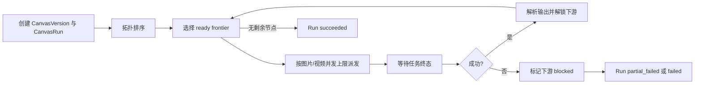

# Lumen 无限画布工作流设计

- **状态**：首版纵向闭环已落地（P1-P3 关键路径），灰度默认关闭；完整阶段验收继续按本文推进
- **日期**：2026-07-13
- **目标版本**：首个正式版本覆盖持久化画布、图片节点、视频节点与可靠恢复；整图自动执行分阶段上线
- **关联模块**：`apps/web`、`apps/api`、`apps/worker`、`packages/core`
- **关联文档**：`apps/web/DESIGN.md`、`docs/video-generation-design.md`、`docs/advanced-storyboard-redesign-design-v1.md`

---

## 0. 执行摘要

无限画布不是另一套生图或生视频页面，而是 Lumen 现有多模态能力之上的自由编排层。

用户可以把提示词、上传图片、历史图片、历史视频、图片生成器和视频生成器放到一张可无限平移缩放的画布中，通过有类型的端口连接，并从任意结果继续分支。画布负责保存结构、输入绑定、版本选择和执行历史；真正的生成任务继续复用现有 `Generation`、`VideoGeneration`、Outbox、Worker、计费、对象存储、SSE 和重试机制。

核心设计决策：

| 主题 | 决策 |
|---|---|
| 产品入口 | 作为“项目”中的新工作流，路由为 `/projects/canvas`，不增加第六个主导航 |
| 画布引擎 | 使用 `@xyflow/react`，不基于 Konva 从底层手写节点图编辑器 |
| 数据边界 | 新建 Canvas 文档、不可变版本、操作批次、Run、NodeExecution、输出选择、资产引用和 Run Event，不复用固定步骤型 `workflow_runs` |
| 执行能力 | 图片复用 `Generation/Image`，视频复用 `VideoGeneration/Video` |
| 图语义 | 可自由布局与分支，但可执行依赖必须是有类型的有向无环图 |
| 首版执行 | 支持“运行当前节点”；服务端“运行到这里/运行全部”在后续阶段启用 |
| 结果版本 | 每次执行都是不可变快照；重新生成不覆盖旧结果 |
| 输出选择 | 节点维护 Active Output；每条边可选择“跟随 Active”或“固定到某次执行” |
| 一致性 | 运行中的任务使用提交时快照，后续编辑不会改变已提交任务 |
| 协作边界 | 首版不做多人实时协作；通过 revision、同浏览器提示和冲突恢复防止覆盖 |
| 资产归属 | 节点引用资产但不拥有资产；删节点或删画布不自动删除生成图片/视频 |
| 移动端 | 支持浏览、调参、运行和结构编辑；连接采用“点端口，再点目标端口”辅助模式 |
| 保存协议 | 前端提交领域操作批次，服务端在 revision 条件下原子应用，不按拖动帧覆盖整张 JSON |
| 运行事件 | 一个 Canvas Run 使用单一有序事件流；真实任务 SSE 只作为底层增量来源 |
| 产品模式 | 编辑模式负责搭图；运行视图负责填写公开输入、执行、审批和查看结果 |

首个正式版本必须稳定跑通：

```text
提示词 -> 图片生成 -> 选择图片版本 -> 视频生成 -> 标记为最终交付
```

### 0.1 当前实施边界

本次工程落地覆盖：

- Canvas 数据模型、0044 migration、领域 Mutation、revision、版本、Run、Execution、Selection、AssetRef 与 Run Event。
- 项目入口、画布列表/新建/工作区、类型安全连接、undo/redo、串行自动保存、IndexedDB 草稿和同浏览器多标签页冲突提示。
- 图片与视频单节点真实任务提交、幂等防重、输出历史与 Active Output、follow_active/pinned、Worker reconcile 和资产引用保护。
- 移动端节点编辑、点选连接辅助、44px 触控命中区，以及独立 `canvas.enabled` 灰度闸门。

仍按后续阶段推进：

- 自动 operation rebase、Canvas Run SSE 消费和结构列表的完整无障碍编辑。
- P4 的整图计划、费用预检、运行到这里/运行全部、运行级取消与预算。
- Playwright 多视口 E2E、200/500/1000 节点性能基准和生产恢复演练。

---

## 1. 背景与现状

### 1.1 当前能力

Lumen 已经具备以下可靠基建：

- 图片生成、图片编辑、多参考图、局部修改和多版本资产。
- 独立视频生成任务、参考图片/视频、持久化轮询、取消、重试和计费。
- 隐藏工作流会话，用于项目型图片生成而不污染普通会话列表。
- PostgreSQL 事实源、Redis 队列与 Pub/Sub、Transactional Outbox。
- 浏览器断线后的 SSE replay、任务快照和主动轮询恢复。
- 全局图片任务中心、视频页任务历史、资产库与 Lightbox。
- 服饰、海报和 Storyboard 等固定步骤型项目工作流。

当前缺少的是一种自由组合能力。用户可以在各个页面完成单次生成或固定流程，但难以自然表达以下关系：

```text
同一个提示词
  ├─ 生成横版主视觉
  │    ├─ 改成夜景版
  │    └─ 作为视频首帧
  └─ 生成竖版封面
       └─ 继续图生图
```

线性对话适合探索，固定工作流适合标准交付；无限画布负责中间地带：自由、多分支、可回看、可复用的视觉生产过程。

### 1.2 为什么不能只做前端节点图

如果画布只把节点和连线存在浏览器里，会出现以下根本问题：

- 刷新或换设备后结构丢失。
- 浏览器关闭后无法继续多节点执行。
- 任务成功，但画布不知道结果属于哪个节点。
- 节点重跑后，下游可能偷偷使用了错误版本。
- 同一节点被重复点击，产生重复计费任务。
- 修改画布时可能覆盖运行中任务的状态。
- 无法审计一次整图执行到底用了哪些输入和参数。

因此画布必须是一个持久化领域模型，而不只是 React Flow 的序列化结果。

### 1.3 为什么不复用 `WorkflowRun`

现有 `WorkflowRun/WorkflowStep` 面向固定阶段流程，核心字段包含 `current_step`、`quality_mode`、`product_image_ids` 和按业务定义的 `step_key`。它适合服饰、海报、Storyboard 这类结构明确的工作流。

无限画布的结构具有以下差异：

- 节点数量和类型由用户决定。
- 同一类型节点可以出现任意次。
- 分支、汇合和布局是核心数据。
- 没有单一的 `current_step`。
- 同一个节点可能执行多次，并选择不同历史结果作为当前输出。
- 一次“运行到这里”需要绑定一个不可变的整图快照。

强行复用 `WorkflowRun` 会把图结构塞进 `metadata_jsonb`，同时让 `WorkflowStep` 承担节点、执行和版本三种职责，后续查询、并发和迁移都会变得不清晰。

结论：无限画布单独建模，但复用现有任务引擎。

---

## 2. 产品目标与非目标

### 2.1 产品目标

1. **自由编排**
   用户可以把提示词、图片、视频和生成器自由摆放、连接、分支和复用。

2. **跨模态连续创作**
   图片结果可以直接成为图生图参考或视频首帧；视频、图片和提示词使用统一的连接模型。

3. **结果可恢复**
   关闭浏览器、断网、Worker 重启后，已提交任务继续运行，重开画布能恢复真实状态。

4. **执行可解释**
   每次执行都能回答：用了什么节点配置、哪些输入版本、生成了什么资产、花费多少、为什么失败。

5. **版本不丢失**
   重新生成不会覆盖旧结果，用户可以在历史版本之间切换，并明确控制下游使用哪个版本。

6. **成本可控**
   不允许因为连了一张大图就隐式执行大量任务。所有批量执行必须先显示节点数、预计成本和并发策略。

7. **桌面高效，移动可用**
   桌面强调拖拽、快捷键和批量操作；手机提供完整查看、参数编辑、运行与可完成的结构修改路径。

8. **与 Lumen 一致**
   结果进入现有资产库，任务进入现有任务体系，界面遵守 Lumen 主题、文案、移动安全区和可访问性规范。

### 2.2 首版非目标

- 不做 Photoshop/Figma 式图层编辑和像素级合成。
- 不做多人光标、实时共同编辑和评论协作。
- 不允许自定义 JavaScript/Python 节点。
- 不做循环、条件分支、定时器和无限自动化。
- 不做任意第三方 Provider 节点编辑器。
- 不做复杂变量语言、表达式求值和模板脚本。
- 不做自动布局作为主路径；首版以用户手动布局为主。
- 不把完整视频剪辑器塞入节点。
- 不让画布替代 Studio、视频页和固定项目工作流。

### 2.3 后续可扩展方向

- 文本增强/翻译/结构化提示词节点。
- 图片抠图、放大、局部修改、拼图和质量检测节点。
- 视频拼接、抽帧、首尾帧、字幕和音频节点。
- 运行到这里、运行选中分支、运行全部。
- 可复用子画布、模板和参数变量。
- 只读分享、模板导入导出和团队协作。

---

## 3. 目标用户与核心任务

### 3.1 主要用户

**视觉创作者**

需要连续尝试构图、风格和比例，并从多个中间结果继续分支。

**电商与内容运营**

需要从商品图产生主图、场景图、竖版内容、横版广告和视频素材。

**视频创作者**

需要先确定关键视觉，再把选中的图片送入视频模型。

**高级 Lumen 用户**

已经熟悉 Studio、视频页和项目工作流，希望减少页面切换并保留完整创作脉络。

### 3.2 核心 JTBD

- 当我需要尝试多个视觉方向时，我希望从同一输入快速分支，而不是反复上传和复制提示词。
- 当我找到一张合适图片时，我希望直接把它连接到视频生成，而不是下载后重新上传。
- 当我重新生成某个中间节点时，我希望旧结果仍然可用，并明确知道下游用了哪一版。
- 当我关闭网页后，我希望任务继续完成，回来时画布状态和结果都还在。
- 当一次工作流包含多个高成本节点时，我希望系统在运行前告诉我会执行什么、预计花费多少。

---

## 4. 产品原则

### 4.1 画布保存“关系”，资产保存“结果”

画布节点只引用图片或视频 ID。图片和视频仍由现有资产表、对象存储和删除策略管理。

结果不会因为节点被删除而消失；用户可以从资产库重新拖回画布。

### 4.2 自由不等于模糊

节点可以自由摆放和分支，但每条连接都必须有明确的数据类型、输入角色和顺序。

系统不能猜：

- 哪张图片是首帧。
- 哪张图片是主参考。
- 多个提示词如何拼接。
- 多个生成版本应该使用哪一个。

有歧义时必须要求用户显式选择。

### 4.3 手动执行优先于隐式自动执行

连接节点本身不触发任务。参数修改、移动节点、切换输出版本都不会自动扣费。

执行只能由明确动作触发：

- 运行当前节点。
- 运行到这里。
- 运行选中分支。
- 运行全部。

后面三种在完整预检后才允许开始。

### 4.4 一次执行对应一个不可变快照

任务提交后，即使用户修改提示词、断开连线或切换输入版本，已提交任务继续使用提交时的快照。

这保证：

- 上游请求可复现。
- 计费与输入能够审计。
- 运行中编辑不会产生竞态。

### 4.5 不伪造进度

图片与视频节点只显示已有真实阶段：

- 排队中。
- 等待可用通道。
- 生成中。
- 取回结果。
- 保存中。
- 已完成。
- 失败，可重试。

不使用按时间估算的假百分比替代真实上游状态。

### 4.6 内容优先

画布节点中的媒体预览是视觉核心。状态、参数和操作围绕内容展开，不把每个节点做成参数表单卡片。

---

## 5. 信息架构与路由

### 5.1 入口位置

无限画布放在“项目”中心，新增工作流入口：

```text
项目
  ├─ 无限画布
  ├─ 服饰模特图
  ├─ 海报制作
  ├─ 分镜制作
  └─ 风格库
```

原因：

- 画布具有项目、标题、更新时间、缩略图和持续编辑语义。
- 当前移动主导航已经有五项，不适合继续增加。
- 画布与固定工作流并列，用户容易理解“自由工作流”和“模板工作流”的区别。

### 5.2 路由

```text
/projects/canvas
  CanvasProjectIndex

/projects/canvas/new
  创建空白画布或从模板创建

/projects/canvas/[canvasId]
  CanvasWorkspace
```

### 5.3 项目列表

每个画布项目展示：

- 标题。
- 缩略图，优先使用标记为最终结果的图片，其次使用最近成功图片。
- 节点数和连接数。
- 图片/视频产出数量。
- 当前运行中任务数。
- 最后更新时间。
- 保存冲突或执行失败提示。

操作：

- 打开。
- 重命名。
- 复制画布。
- 软删除。
- 从该画布创建模板，后续阶段提供。

### 5.4 创建体验

创建页不是营销或说明页，只提供：

- 空白画布。
- 图片到视频。
- 商品图多方向。
- 多比例视觉。
- Storyboard 关键帧到视频。

模板创建后直接进入真实画布，并选中第一个待填写节点。

---

## 6. 画布工作区体验

### 6.1 桌面布局

```text
┌───────────────────────────────────────────────────────────────────┐
│ 返回  标题/保存状态     撤销 重做 适应视图  运行      任务  账户 │
├──────────────┬───────────────────────────────────────┬────────────┤
│ 节点工具栏    │                                       │ 参数检查器 │
│              │              无限画布                  │            │
│ 提示词        │                                       │ 节点参数   │
│ 图片素材      │                                       │ 输入绑定   │
│ 视频素材      │                                       │ 版本历史   │
│ 图片生成      │                                       │ 执行信息   │
│ 视频生成      │                                       │            │
└──────────────┴───────────────────────────────────────┴────────────┘
```

设计约束：

- 中间画布全高、全宽，不放在装饰性卡片中。
- 左侧工具栏可折叠。
- 右侧检查器只在选中节点或连线时出现。
- 图片和视频节点允许比文本节点更宽，但使用稳定尺寸约束。
- 顶栏只显示全局动作，高级参数不堆在顶栏。

### 6.2 节点创建方式

支持四种方式：

1. 从左侧工具栏拖入。
2. 双击空白区域打开节点搜索。
3. 右键空白区域打开上下文菜单。
4. 从输出端口拖到空白处，弹出只显示兼容节点的快速创建菜单。

节点搜索支持：

- 中文名称。
- 英文类型。
- 常见动作，例如“生图”“首帧”“上传”“交付”。

### 6.3 画布基础操作

| 操作 | 桌面 | 移动 |
|---|---|---|
| 平移 | 空格拖拽、中键拖拽 | 单指空白区域拖动 |
| 缩放 | 触控板/滚轮、工具栏 | 双指缩放 |
| 框选 | 空白拖拽 | 长按进入多选 |
| 多选 | Shift 点击 | 多选模式 |
| 连接 | 从输出端口拖到输入端口 | 点输出端口，再点目标输入端口 |
| 删除 | Delete/Backspace | 节点菜单 |
| 复制 | Cmd/Ctrl+D | 节点菜单 |
| 撤销 | Cmd/Ctrl+Z | 顶栏 |
| 重做 | Cmd/Ctrl+Shift+Z | 顶栏 |
| 适应视图 | Cmd/Ctrl+0 | 顶栏 |
| 搜索节点 | Cmd/Ctrl+F | 顶栏/菜单 |

### 6.4 选择与检查器

节点卡片只展示高频信息：

- 节点名称。
- 媒体或提示词摘要。
- 当前状态。
- 运行按钮。
- 输入/输出端口。

完整参数放在右侧检查器：

- 节点配置。
- 输入连接和角色。
- 当前选中输出。
- 历史执行。
- 诊断与失败信息。
- 删除、复制、转换等次要动作。

### 6.5 连线体验

连线必须提供以下反馈：

- 兼容端口高亮。
- 不兼容端口保持不可连接状态。
- 松开到空白处时提供兼容节点创建菜单。
- 连接完成后显示输入角色，例如“首帧”“参考图”“提示词”。
- 多输入端口显示顺序，并允许在检查器中调整。
- 删除连线后，下游节点立即标记为输入变化或缺失。

普通连线不持续动画。只有正在执行的数据路径可以显示克制的流动状态，并遵守 `prefers-reduced-motion`。

### 6.6 空状态

空白画布不显示大段教程。默认在视口中央放一个可直接编辑的“提示词”节点和一个“图片生成”节点，两者已连接。

用户删除全部节点后，只显示简短动作：

- 添加节点。
- 从素材库拖入。
- 使用模板。

### 6.7 小地图

- 节点少于 30 个时默认隐藏。
- 节点较多或画布范围较大时自动提供入口。
- 小地图只显示节点类型和状态，不渲染媒体缩略图。
- 手机不常驻显示，放入视图工具菜单。

### 6.8 编辑模式与运行视图

成熟的 Canvas 不能要求每个使用者都理解完整节点图。产品需要区分：

**编辑模式**

- 添加、删除、移动和连接节点。
- 配置端口、模型参数、版本绑定和执行策略。
- 查看 stale、blocked、历史执行和诊断。

**运行视图**

- 只展示被作者标记为“公开输入”的 Prompt/Asset 参数。
- 只展示被标记为“公开输出”的预览或 Delivery。
- 提供预计成本、运行、暂停、取消、重试和审批。
- 隐藏内部组织节点、技术端口和 Provider 诊断。

运行视图的目的不是权限隔离，而是降低重复使用同一画布时的认知成本。首个正式版本可以只提供基础运行面板；完整的公开输入编排和模板发布在 P5 完成。

### 6.9 视口属于本地视图状态

节点位置和分组属于文档，当前 zoom、pan、选中节点和打开的检查器不属于协作图数据。

规则：

- viewport 按 `canvas_id + device_class` 存在本地。
- 服务端可保存一个不参与 graph revision 的 last-view fallback。
- 手机和桌面拥有独立 viewport。
- viewport 更新不产生 undo、不触发 graph revision 冲突。
- “适应全部”“适应选中”和 Frame 导航用于跨设备快速恢复位置。

---

## 7. 领域模型与概念

### 7.1 CanvasDocument

用户可持续编辑的画布文档，包含当前节点定义、连线、位置和 Frame。Document 的 `revision` 是乐观锁版本，不等于用户看到的命名版本。

### 7.2 CanvasNodeDefinition

节点当前配置。它是可编辑的，不代表某次执行实际使用的最终参数。

### 7.3 CanvasEdge

一个有类型的数据绑定，描述源节点哪个输出连接到目标节点哪个输入，并携带角色和顺序。

### 7.4 CanvasRun

一次明确触发的运行：

- 单节点运行。
- 运行到这里。
- 运行选中分支。
- 运行全部。

Run 绑定启动时创建的不可变 CanvasVersion 和目标节点，不受后续编辑影响。

### 7.5 CanvasNodeExecution

Run 中某个节点的一次执行快照，绑定真实图片或视频任务。

它保存：

- 节点配置快照。
- 解析后的输入快照。
- 输入与配置 fingerprint。
- 真实任务 ID。
- 状态、错误和输出。
- 提交时的 selection revision。

### 7.6 CanvasMutation

一次原子图编辑操作批次，例如添加节点、移动多个节点、删除节点及关联边、修改节点配置。

Mutation 保存 base revision、result revision、client ID、mutation ID 和领域操作，用于：

- 写请求幂等。
- 多标签冲突诊断。
- 客户端 rebase。
- 审计和故障恢复。

### 7.7 CanvasVersion

不可变画布快照，在以下时机创建：

- 启动 Run。
- 用户创建命名版本。
- 恢复旧版本。
- 导入外部画布。
- 发布模板。

普通拖动和文本输入只增加 Document revision 和 Mutation，不为每个像素创建完整版本快照。

Version 同时冻结：

- Graph。
- 所有 Active Output selection revision。
- `follow_active` Edge 解析到的 execution/output。
- graph hash 和 selection hash。

因此 Run、恢复和命名版本不会因为之后切换 Active Output 而改变含义。

### 7.8 当前输出

一个生成节点可以有多个成功执行。当前输出是用户明确选择给下游使用的那次执行结果。

输出选择不是删除关系。旧结果仍保留在执行历史和资产库中。

当前输出由独立的 CanvasNodeSelection 保存，不与 graph autosave 争抢 revision。

### 7.9 CanvasRunEvent

Run 内单调递增的持久事件：

- 节点进入 ready/queued/running/terminal。
- 输出物化。
- 分支 blocked。
- Run 暂停、继续、取消和结束。

客户端通过一个 Run channel 消费增量，并始终可以用 REST Run 快照修复。

### 7.10 CanvasAssetRef

画布 head、不可变版本、节点执行和交付结果对图片/视频的显式引用。

AssetRef 用于：

- 删除影响分析。
- 防止错误垃圾回收。
- 备份恢复校验。
- 判断某个产物是否仍被画布、版本或执行历史引用。

### 7.11 最终交付

“交付节点”用于收集用户认定的最终图片和视频。它不生成新媒体，但提供：

- 画布项目缩略图来源。
- 最终结果集合。
- 批量下载入口。
- 后续分享与导出的稳定边界。

---

## 8. 节点系统

### 8.1 通用节点结构

```ts
type CanvasNodeDefinition = {
  id: string;
  type: CanvasNodeType;
  schema_version: number;
  title: string;
  position: { x: number; y: number };
  size?: { width: number; height: number };
  parent_group_id?: string | null;
  config: Record<string, unknown>;
  ui: {
    collapsed?: boolean;
    color_tag?: string | null;
  };
};
```

不持久化：

- `selected`
- `dragging`
- `measured`
- 临时 hover
- React Flow 内部对象
- 本地上传中的 Blob URL

命名规则：

- 节点按能力命名，例如“图片生成”“视频生成”，不按具体模型命名。
- 模型和 Provider 是 Inspector 中的运行参数与有效快照。
- 模型升级或下架时，旧节点仍能打开，并通过兼容映射或明确升级动作处理。

生成规则：

- 每次生成默认进入原生成节点的 Execution 历史，不自动在画布上制造新节点。
- 用户从某个结果继续连线时直接使用该节点输出。
- 用户需要把结果变成稳定独立素材时，使用“固定为素材节点”，创建 ImageAsset/VideoAsset 节点。

### 8.2 V1 节点目录

#### 8.2.1 提示词节点 `prompt`

- 输入：无
- 输出：`text`

配置：

- 文本，最大长度沿用 `MAX_PROMPT_CHARS`。
- 可选标题。
- 可选锁定，防止批量编辑误改。

行为：

- 修改文本会使所有直接或间接下游执行节点变为 stale。
- 空文本可以存在，但连接到必需提示词输入时，下游为 invalid。

#### 8.2.2 图片素材节点 `image_asset`

- 输入：无
- 输出：`image`

来源：

- 本地上传。
- 资产库。
- 模特库或风格库转换为普通图片引用。
- 从 Lightbox “发送到画布”。

配置：

- `image_id`。
- 可选显示名称。
- 可选裁切仅影响预览，不改变原图。

行为：

- 上传必须先完成并取得服务端 `image_id`，再写入画布。
- 图片被资产库软删除后，节点显示“素材已删除”，不保留失效签名 URL。

#### 8.2.3 视频素材节点 `video_asset`

- 输入：无
- 输出：`video`

配置：

- `video_id`。
- 可选显示名称。

行为：

- 节点默认显示 poster，不自动播放。
- 只有用户打开预览或明确播放时加载视频流。

#### 8.2.4 图片生成节点 `image_generate`

输入：

- `prompt:text`，最多 1 个，首版必需。
- `references:image`，多个。
- `mask:image`，最多 1 个，仅在符合局部修改约束时启用。

输出：

- `image`，可以有多个候选，当前输出由用户选择。

配置：

- 图片模型/路由由现有系统设置和账户模式决定。
- 比例。
- 1K/2K/4K。
- 渲染质量。
- 数量。
- Fast。
- 输出格式、压缩、背景和 moderation。
- 参考图角色与权重。

执行映射：

- 无参考图：`text_to_image`。
- 有参考图：`image_to_image`。
- mask 存在：执行现有 inpaint 约束。

#### 8.2.5 视频生成节点 `video_generate`

输入：

- `prompt:text`，最多 1 个，必需。
- `first_frame:image`，最多 1 个。
- `reference_images:image`，多个。
- `reference_videos:video`，多个。
- `reference_audio:audio`，后续开放。

输出：

- `video`。

配置：

- action 由输入组合和用户明确模式决定，不做不可见猜测。
- model。
- duration。
- resolution。
- aspect ratio。
- generate audio。
- seed。
- watermark。

约束：

- `t2v` 不接受首帧和参考素材。
- `i2v` 必须且只能有一个首帧。
- `reference` 按现有 Provider 能力限制图片和视频数量。
- 切换模式时，不兼容连线不静默删除；显示冲突并要求确认。

#### 8.2.6 备注节点 `note`

不参与执行。

支持短文本、标题和少量语义标签。备注不是 Markdown 文档编辑器，不加载复杂富文本。

#### 8.2.7 Frame 节点 `frame`

不参与执行。

用于给一片画布区域命名、折叠、导航和批量移动。Frame 不改变执行拓扑，也不自动成为子工作流。

Frame 可以标记：

- 阶段或方向，例如“主视觉”“短视频”“备选方向”。
- 是否在运行视图隐藏。
- 是否允许作为“运行选中分支”的目标范围。

普通临时 Group 仍可以由多选操作形成，但它属于编辑器操作，不需要伪装成有执行端口的节点。

#### 8.2.8 交付节点 `delivery`

输入：

- 多个 `image`。
- 多个 `video`。

输出：无。

功能：

- 标记最终结果。
- 批量下载。
- 设定项目缩略图。
- 显示每个输入的来源节点和版本。

### 8.3 V2 候选节点

- 文本增强 `prompt_enhance`。
- 文本组合 `prompt_merge`。
- 图片放大 `image_upscale`。
- 图片局部修改 `image_inpaint`。
- 背景移除 `background_remove`。
- 图片选择器 `image_select`。
- 视频拼接 `video_assemble`。
- Storyboard 导入节点。
- 子画布 `subcanvas`。

V2 节点仍必须使用注册表和服务器白名单，不能从 graph JSON 动态执行任意代码。

---

## 9. 端口与连接契约

### 9.1 数据类型

首版端口类型：

```text
text
image
video
mask
```

`mask` 在存储上仍是 Image，但连接语义单独标记，避免普通图片误接到遮罩输入。

### 9.2 连接结构

```ts
type CanvasEdge = {
  id: string;
  source_node_id: string;
  source_handle: string;
  target_node_id: string;
  target_handle: string;
  data_type: "text" | "image" | "video" | "mask";
  binding_mode: "follow_active" | "pinned";
  pinned_execution_id?: string | null;
  pinned_output_index?: number | null;
  role?: string | null;
  order?: number | null;
};
```

`follow_active`：

- 使用源节点当前 Active Output。
- 源节点切换输出后，目标节点 stale。
- 适合探索和持续迭代。

`pinned`：

- 固定到某次成功 execution 的某个 output index。
- 源节点之后再生成或切换 Active Output，不改变该边输入。
- 适合已经批准的关键帧、交付图和高成本视频输入。

禁止按“最后完成时间”隐式选择版本。连接创建时默认 `follow_active`；用户可以在 Edge Inspector 中固定版本。

### 9.3 输入基数

| 目标输入 | 类型 | 基数 | 说明 |
|---|---|---:|---|
| 图片生成提示词 | text | 1 | 多提示词必须先经过未来的文本组合节点 |
| 图片参考 | image | N | 上限沿用请求与 Provider 限制 |
| 图片 mask | mask | 0..1 | 同时校验单参考图约束 |
| 视频提示词 | text | 1 | 必需 |
| 视频首帧 | image | 0..1 | i2v 必需 |
| 视频参考图 | image | N | 按 Provider 限制 |
| 视频参考视频 | video | N | 按 Provider 限制 |
| 交付输入 | image/video | N | 只读收集 |

### 9.4 多输入顺序

多张参考图的顺序是业务数据，不能依赖边在数组中的偶然顺序。

规则：

- Edge 保存显式 `order`。
- 检查器允许拖动排序。
- 删除中间项后重新规范化为连续序号。
- API 执行时按 `order` 解析。
- Run 快照保存最终解析顺序。

### 9.5 参考角色

图片参考边可以设置：

- reference。
- subject。
- product。
- style。
- edit_target。
- background。
- other。

角色影响现有结构化附件元数据，但不承诺所有 Provider 都原生理解权重。

### 9.6 环检测

可执行边不允许形成环。

校验发生在三层：

1. 前端连接时即时检测。
2. 保存 graph 时后端完整检测。
3. 创建 Run 时针对运行快照再次检测。

备注与分组不参与拓扑。首版不提供“仅视觉关联线”，避免用户误以为视觉连线会影响执行。

---

## 10. 节点状态模型

节点状态不能用一个字符串混合表达配置、输入和任务状态。建议分成三个维度。

### 10.1 配置状态

```text
incomplete  必填参数缺失
valid       当前配置合法
invalid     参数组合不合法
```

### 10.2 输入状态

```text
unresolved  上游没有可用输出
resolved    输入均可解析
stale       上游配置或输出选择已变化
blocked     上游执行失败或素材失效
```

### 10.3 执行状态

`idle` 只是“当前节点没有活动 execution”的 UI 派生状态，不写入 Execution 表。

```text
pending
ready
queued
running
succeeded
partial_failed
failed
blocked
canceled
skipped
reused
reconciling
canceling
```

终态：

```text
succeeded
partial_failed
failed
blocked
canceled
skipped
reused
```

非终态：

```text
pending
ready
queued
running
reconciling
canceling
```

关键转换：

| 当前 | 事件 | 下一状态 |
|---|---|---|
| pending | 依赖满足 | ready |
| ready | 预算预留与叶子任务创建成功 | queued |
| queued | 任一叶子任务开始 | running |
| running/reconciling | 全部叶子成功 | succeeded |
| running/reconciling | 部分成功、部分失败 | partial_failed |
| running/reconciling | 全部失败 | failed |
| pending/ready | 上游不可恢复失败 | blocked |
| pending/ready | 成功执行完全复用 | reused |
| pending/ready | 目标不需要运行 | skipped |
| 非终态 | 用户取消请求 | canceling |
| canceling | 所有叶子确认取消且无成功结果 | canceled |
| canceling | 结果先于取消确认成功 | succeeded/partial_failed |

Execution terminal 后不重新打开。用户重试创建 repair Run 中的新 Execution。

Run 聚合：

- 任一目标 Execution 为 partial_failed：partial_failed；已成功物化的输出仍保留。
- 所有目标成功/reused/skipped：succeeded。
- 至少一个成功且至少一个 failed/blocked/canceled：partial_failed。
- 无成功目标且存在 failed/blocked：failed。
- 用户取消且没有晚到成功目标：canceled。

### 10.4 UI 合成状态

显示优先级：

```text
running/queued/reconciling/canceling
  > invalid/incomplete
  > blocked
  > stale
  > partial_failed
  > failed
  > succeeded
  > ready
```

状态不能只用颜色表达，必须同时显示图标或短文本。

---

## 11. 版本、选择与过期传播

### 11.1 执行不可变

每次执行创建新的 `CanvasNodeExecution`。失败重试也创建新的 attempt 或新的 execution，不覆盖原记录。

### 11.2 当前输出选择

成功执行后：

- 默认选择最新成功结果。
- 如果节点输出选择被用户锁定，新成功结果只进入历史，不自动切换 Active Output。
- 用户可以从历史中选择任意成功执行。
- 一个节点同一时间最多有一个 CanvasNodeSelection。

图片节点一次生成多张时，还需要选择 execution 内的具体输出索引。

自动选择必须使用 CAS：

- Execution 创建时记录 `selection_base_revision`。
- 任务成功时，只有节点当前 selection revision 仍等于 base revision，且当前节点 fingerprint 与提交时一致，才能自动选择。
- 晚到的旧任务、已删除节点和旧配置任务只能进入历史，不得覆盖 Active Output。

### 11.3 Edge 版本绑定

下游解析输入时：

- `follow_active` 读取 CanvasNodeSelection。
- `pinned` 读取 Edge 保存的 execution/output。
- pinned 输出被资产策略删除时，Edge 进入 blocked，不自动回退到 Active Output。

切换 Active Output 只让 `follow_active` 下游 stale；固定边保持不变。

### 11.4 Fingerprint

每次执行计算：

```text
definition_hash = hash(node_type + normalized_config)
canonical_input = canonical_json({
  text_values,
  image_ids_and_sha256,
  video_ids_and_sha256,
  mask_ids_and_sha256,
  source_execution_ids,
  output_indexes,
  roles,
  order,
  binding_mode
})
input_hash      = hash(canonical_input)
execution_fingerprint = hash(
  definition_hash
  + input_hash
  + node_schema_version
  + effective_model
  + effective_provider_capability
  + processor_version
)
```

Canonical JSON 使用稳定 key 顺序、固定数值格式、UTF-8 和 NFC 字符串归一化。除 Unicode 等价组合形式外，任何文本字符变化都必须改变 input hash；前端和后端不能各自实现不同的 hash 规则，权威 fingerprint 只由服务端计算。

用途：

- 判断是否 stale。
- 幂等校验。
- 在批量运行前复用已存在且完全匹配的成功执行。
- 审计输入与成本。
- 防止旧结果在新图版本上提交为 Active Output。

### 11.5 Stale 规则

以下变化会让节点 stale：

- 自身执行参数变化。
- 提示词内容变化。
- 输入连线变化。
- 输入角色或顺序变化。
- 上游节点切换当前输出。
- 上游资产被删除或替换。

Stale 通过图拓扑向下游传播。

### 11.6 运行中编辑

用户可以在任务运行时继续编辑画布。

规则：

- 运行节点显示“本次任务使用旧配置”提示。
- 当前任务完成后，结果进入历史。
- 如果当前节点定义已经变化，完成结果不会把节点自动变成 fresh。
- 只有 execution fingerprint 与当前解析 fingerprint 相同，节点才显示为最新。

### 11.7 操作历史、命名版本、运行历史和媒体谱系

四种历史必须分开：

| 历史 | 用途 | 是否可撤销外部生成 |
|---|---|---|
| 操作历史 | 当前编辑会话的 undo/redo | 否 |
| 命名版本 | 完整画布快照、恢复、复制 | 否 |
| NodeExecution 历史 | 某节点每次运行的输入、参数、成本和结果 | 否 |
| 媒体谱系 | 图片/视频从哪个任务和父媒体派生 | 不适用 |

恢复命名版本会创建新的 Document revision，不会删除恢复点之后的 Run、Execution 或资产。

恢复事务同时：

- 把 Version graph 作为新的 Document head。
- 按 selection snapshot 恢复 CanvasNodeSelection。
- 对已经过期或不可见的输出保留绑定但标记 blocked，不自动改用其他版本。
- 创建 `kind=restore` 的新 CanvasVersion，形成可审计恢复链。

Branch 和版本比较放入 V2：

- Branch 从一个 CanvasVersion 创建。
- 比较新增/删除节点、参数、位置、Edge 和输出绑定。
- 合并以节点或 Frame 为单位。
- 生成媒体只做引用选择，不做二进制内容合并。

### 11.8 节点删除

删除运行中节点时提供：

- 仅从画布移除，任务继续。
- 取消任务并移除。
- 取消。

无论选择哪一种，已产生的图片或视频资产不会自动删除。

---

## 12. 核心用户流程

### 12.1 文生图到图生视频

1. 创建画布。
2. 编辑默认提示词节点。
3. 运行图片生成节点。
4. 节点显示排队和生成状态。
5. 成功后默认选择第一张结果。
6. 从图片输出连接到视频节点首帧输入。
7. 编辑视频提示词和参数。
8. 运行视频节点。
9. 关闭页面。
10. 稍后重开画布，恢复视频进度或结果。
11. 把最终图片和视频连接到交付节点。

### 12.2 多方向分支

1. 一个提示词节点连接三个图片生成节点。
2. 三个节点分别设置 1:1、4:5、16:9。
3. 用户逐个运行，或后续使用运行选中节点。
4. 任一结果可以继续连接到独立图生图或视频节点。

### 12.3 重新生成与版本切换

1. 图片节点已有版本 A，并被视频节点使用。
2. 用户重新运行，得到版本 B。
3. 如果未固定版本，图片节点选择 B。
4. 视频节点变为 stale，但不会自动重新生成。
5. 用户可以切回 A，视频节点恢复为与原输入匹配的 fresh 状态。

### 12.4 失败恢复

1. 上游图片任务失败。
2. 节点显示真实错误和推荐动作。
3. 下游节点显示“上游无可用结果”，不可运行。
4. 用户可以重试原配置，或修改参数后创建新执行。
5. 成功后下游解除 blocked，但是否 stale 取决于 fingerprint。

### 12.5 素材被删除

1. 画布引用一张资产库图片。
2. 用户在资产库软删除图片。
3. 重开画布时图片节点显示素材失效。
4. 节点提供“替换素材”。
5. 系统不使用缓存 URL 偷偷继续执行。

---

## 13. 执行语义

### 13.1 首版：运行当前节点

运行按钮只执行当前选中生成节点。

预检步骤：

1. 读取服务端最新 graph revision。
2. 校验节点仍存在且类型受支持。
3. 校验节点配置。
4. 解析直接输入。
5. 校验上游当前输出、资产归属与存活状态。
6. 计算 fingerprint 和预计成本。
7. 为当前 Document revision 创建或复用不可变 CanvasVersion。
8. 创建 `CanvasRun(kind="single")`。
9. 创建 `CanvasNodeExecution`。
10. 创建真实图片或视频任务及 Outbox。
11. 同一事务提交关联、预算和第一条 Run Event。

连接上游节点不会自动执行。如果上游没有输出，当前节点为 unresolved。

### 13.2 后续：运行到这里

“运行到这里”选择目标节点的所有祖先执行节点，构建不可变运行快照。

规则：

- 已有 fingerprint 完全匹配的成功执行可以复用。
- stale、失败或缺失的执行加入本次 Run。
- 运行前展示将复用、将执行和被阻塞的节点。
- 用户确认后由服务端调度，浏览器关闭不影响。
- Run 的所有节点只读取绑定 CanvasVersion，不重新读取 Document head。

### 13.3 后续：运行选中分支

只运行用户选中的多个目标节点及其必要祖先。

### 13.4 后续：运行全部

运行画布中所有可执行节点，但必须满足：

- 图无环。
- 所有必需输入可解析，或能由本次 Run 的祖先产生。
- 任务数量不超过系统限制。
- 预计费用通过预检。
- 用户明确确认。

### 13.5 服务端调度



调度器不在一个 Worker coroutine 中长时间 sleep。每次节点状态变化后重新入队或由短周期 reconciler 推进。

每次推进使用数据库条件更新和 `run_epoch/node_attempt_epoch` fencing。Redis lease 用于减少并发，不作为权威状态，也不能把 Redis 故障解释为用户取消。

### 13.6 并发

并发限制分四层：

- 用户级 Canvas Run 并发。
- 单 Run ready 节点并发。
- 现有图片全局/Provider 并发。
- 现有视频 Provider 并发。

建议初始默认：

```text
每用户活动 Canvas Run: 2
单 Run 同时提交图片节点: 3
单 Run 同时提交视频节点: 1
单次 Run 最大执行节点: 50
```

实际值应由运行时设置配置，并继续受现有 Provider 和钱包约束。

Run 同时保存：

- `failure_policy=continue_independent|fail_fast`。
- `budget_micro`。
- `run_epoch`。
- 最大节点数、最大输出数和截止时间。
- 启动时模型能力与价格快照摘要。

### 13.7 失败策略

默认采用分支隔离：

- 一个节点失败，只阻塞依赖它的下游。
- 与失败节点无依赖的分支继续。
- 最终 Run 可以是 `partial_failed`。

用户可以：

- 只重试失败节点及其下游。
- 跳过可选分支。
- 取消整个 Run。

### 13.8 暂停与取消

V1 单节点运行只提供现有任务取消。

整图运行阶段提供：

- 暂停：不再提交新节点，已提交任务继续。
- 继续：重新计算 ready frontier。
- 取消 Run：不再提交新节点，并尝试取消所有活动任务。

取消不回滚已经成功的资产。

如果调度控制面、Redis 或 Provider 状态暂时不可确认，Run/Execution 使用 `reconciling` 或 `canceling`，不得直接标记成 `canceled`。

---

## 14. 数据模型

建议迁移：`0044_infinite_canvas.py`，实际编号以实施时 Alembic head 为准。

### 14.1 `canvas_documents`

```text
id                    String(36) PK uuid7
user_id               FK users(id) ON DELETE CASCADE
conversation_id       FK conversations(id) ON DELETE SET NULL
title                 String(255)
description           Text
graph_schema_version  Integer
graph_jsonb            JSONB
revision              BigInteger
last_version_id       FK canvas_versions(id) nullable, 迁移建表后补 FK
thumbnail_image_id    FK images(id) ON DELETE SET NULL
created_at            timestamptz
updated_at            timestamptz
deleted_at            timestamptz nullable
```

索引：

```text
(user_id, deleted_at, updated_at DESC, id DESC)
(user_id, title)
```

约束：

- `revision >= 1`。
- graph 必须是对象。
- 标题最大 255 字符。
- graph head 是当前可编辑状态，不是不可变历史。

### 14.2 `canvas_mutations`

保存一次领域操作批次。

```text
id                    String(36) PK uuid7
canvas_id             FK canvas_documents(id) ON DELETE CASCADE
user_id               FK users(id) ON DELETE CASCADE
client_id             String(64)
mutation_id           String(96)
operation_schema_version Integer
base_revision         BigInteger
result_revision       BigInteger
operations_jsonb      JSONB
response_jsonb        JSONB
created_at            timestamptz
```

约束和索引：

```text
UNIQUE(canvas_id, client_id, mutation_id)
UNIQUE(canvas_id, result_revision)
INDEX(canvas_id, base_revision, result_revision)
CHECK result_revision = base_revision + 1
```

Mutation 用于请求幂等、冲突 rebase 和审计。服务端应用 operations 后仍把最新 materialized graph 写入 `canvas_documents.graph_jsonb`，避免每次读取都重放全部历史。

Mutation 可以按保留策略归档或压缩，但命名版本和 Run 绑定的不可变快照不能删除。

### 14.3 `canvas_versions`

不可变画布版本。

```text
id                    String(36) PK uuid7
canvas_id             FK canvas_documents(id) ON DELETE CASCADE
user_id               FK users(id) ON DELETE CASCADE
source_revision       BigInteger
version_no            BigInteger
kind                  run|named|restore|import|template
name                  String(120) nullable
graph_schema_version  Integer
graph_hash            String(64)
graph_jsonb            JSONB
selection_snapshot_jsonb JSONB
selection_hash        String(64)
created_at            timestamptz
```

约束和索引：

```text
UNIQUE(canvas_id, version_no)
INDEX(canvas_id, created_at DESC)
INDEX(canvas_id, graph_hash)
```

相同 `source_revision + graph_hash + selection_hash` 才可以复用已有 Version，避免连续运行同一未修改且未切换输出的画布时重复存储。

### 14.4 `canvas_runs`

```text
id                    String(36) PK uuid7
canvas_id             FK canvas_documents(id) ON DELETE CASCADE
version_id            FK canvas_versions(id) ON DELETE RESTRICT
parent_run_id         FK canvas_runs(id) ON DELETE SET NULL nullable
user_id               FK users(id) ON DELETE CASCADE
kind                  single|repair|upstream|selection|all
status                planning|queued|running|paused|reconciling|canceling|succeeded|partial_failed|failed|canceled
failure_policy        continue_independent|fail_fast
run_epoch             BigInteger
last_event_seq        BigInteger
target_node_ids       ARRAY(String(64))
idempotency_key       String(96)
request_fingerprint   String(64)
budget_micro          BigInteger
reserved_micro        BigInteger
spent_micro           BigInteger
estimated_cost_micro  BigInteger
actual_cost_micro     BigInteger nullable
summary_jsonb         JSONB
cancel_requested_at   timestamptz nullable
deadline_at           timestamptz nullable
started_at            timestamptz nullable
finished_at           timestamptz nullable
created_at            timestamptz
updated_at            timestamptz
```

约束和索引：

```text
UNIQUE(user_id, idempotency_key)
INDEX(canvas_id, created_at DESC)
INDEX(user_id, status, updated_at)
CHECK budget_micro >= 0
CHECK reserved_micro >= 0
CHECK spent_micro >= 0
CHECK estimated_cost_micro >= 0
CHECK actual_cost_micro IS NULL OR actual_cost_micro >= 0
```

`spent_micro` 允许高于 budget，用于如实记录已经提交且无法撤销任务的实际超支。预算上限由锁定 Run 后的调度条件更新保证，不能用会阻止真实结算落库的 CHECK 约束保证。

### 14.5 `canvas_node_executions`

```text
id                       String(36) PK uuid7
canvas_id                FK canvas_documents(id) ON DELETE CASCADE
run_id                   FK canvas_runs(id) ON DELETE CASCADE
user_id                  FK users(id) ON DELETE CASCADE
node_id                  String(64)
node_type                String(48)
node_schema_version      Integer
sequence                 Integer
attempt                  Integer
attempt_epoch            BigInteger
status                   pending|ready|queued|running|reconciling|canceling|succeeded|partial_failed|failed|blocked|canceled|skipped|reused
definition_hash          String(64)
input_hash               String(64)
execution_fingerprint    String(64)
submission_idempotency_key String(96)
request_fingerprint      String(64)
config_snapshot_jsonb    JSONB
input_snapshot_jsonb     JSONB
model_snapshot_jsonb     JSONB
pricing_snapshot_jsonb   JSONB
processor_version        String(64)
outputs_jsonb            JSONB
selection_base_revision  BigInteger
retry_of_execution_id    FK canvas_node_executions(id) ON DELETE SET NULL nullable
reused_from_execution_id FK canvas_node_executions(id) ON DELETE SET NULL nullable
error_code               String(64) nullable
error_message            Text nullable
started_at               timestamptz nullable
finished_at              timestamptz nullable
created_at               timestamptz
updated_at               timestamptz
```

约束：

- 同 Run 中 `node_id + attempt` 唯一。
- `outputs_jsonb` 只保存资产 ID、类型、尺寸和来源任务，不保存签名 URL。
- 用户主动重试创建新的 attempt；Provider 内部自动重试仍属于同一个真实任务。
- `submission_idempotency_key + request_fingerprint` 是用户级 attempt 的持久幂等边界。

索引：

```text
(canvas_id, node_id, created_at DESC)
(run_id, sequence)
(user_id, status, updated_at)
UNIQUE(run_id, node_id, attempt)
UNIQUE(user_id, submission_idempotency_key)
```

### 14.6 `canvas_execution_tasks`

一个 NodeExecution 可以绑定一个或多个叶子任务。图片 `count > 1` 时通常对应多个 Generation。

```text
id                    String(36) PK uuid7
execution_id          FK canvas_node_executions(id) ON DELETE CASCADE
ordinal               Integer
task_kind             generation|completion|video_generation
generation_id         FK generations(id) ON DELETE SET NULL nullable
completion_id         FK completions(id) ON DELETE SET NULL nullable
video_generation_id   FK video_generations(id) ON DELETE SET NULL nullable
status                queued|running|succeeded|failed|canceled|expired
idempotency_key       String(96)
request_fingerprint   String(64)
billing_ref_type      String(32)
billing_ref_id        String(96)
output_jsonb          JSONB
created_at            timestamptz
updated_at            timestamptz
UNIQUE(execution_id, ordinal)
UNIQUE(task_kind, idempotency_key)
UNIQUE(generation_id) WHERE generation_id IS NOT NULL
UNIQUE(completion_id) WHERE completion_id IS NOT NULL
UNIQUE(video_generation_id) WHERE video_generation_id IS NOT NULL
```

约束：

- 三个真实任务 FK 必须且只能存在一个，并与 `task_kind` 匹配。
- 输出按 ordinal 聚合，不能按任务完成时间排序。
- 全部成功：Execution succeeded。
- 部分成功、部分失败：Execution partial_failed，但成功输出仍可选择。
- 全部失败：Execution failed。
- reused Execution 不创建 ExecutionTask，而是记录复用来源。

### 14.7 `canvas_task_terminal_receipts`

防止终态 hook、周期 reconciler 和 GET read repair 重复应用同一终态。

```text
id                    String(36) PK uuid7
execution_task_id     FK canvas_execution_tasks(id) ON DELETE CASCADE
task_kind             String(32)
task_id               String(36)
task_epoch            BigInteger
terminal_status       String(32)
terminal_fingerprint  String(64)
processed_at          timestamptz
UNIQUE(task_kind, task_id, task_epoch)
```

终态桥接先插入 Receipt。`ON CONFLICT DO NOTHING` 未取得所有权的消费者直接返回。

单个叶子终态事务只允许：

- 更新对应 ExecutionTask。
- 写该叶子输出和账务投影。
- 写叶子级 Run Event。

只有检测到该 Execution 的全部 ExecutionTask 都已终态，并成功用 CAS 把 Execution 从非终态推进到聚合终态的唯一事务，才能：

- 聚合 outputs_jsonb。
- 更新 CanvasAssetRef。
- CAS 更新 CanvasNodeSelection。
- 推进下游依赖。
- 更新 Run 聚合状态。
- 写 Execution 聚合 Run Event 和调度 Outbox。

叶子任务进入 Canvas 可见终态前必须先解决“取消晚于成功”“提交状态未知”等底层竞态；同一 task epoch 对 Canvas 只能提交一个终态。需要更正时创建新的 task epoch/attempt，不原地写第二种终态。

### 14.8 `canvas_node_selections`

一个节点当前使用的 Active Output。

```text
canvas_id             FK canvas_documents(id) ON DELETE CASCADE
node_id               String(64)
execution_id          FK canvas_node_executions(id) ON DELETE SET NULL
output_index          Integer
revision              BigInteger
locked                Boolean
updated_at            timestamptz
PRIMARY KEY(canvas_id, node_id)
```

约束：

- `output_index >= 0`。
- execution 必须属于同一 canvas/node。
- 自动选择必须以 `revision` 做 CAS。
- `locked=true` 时新成功 execution 不自动替换。

### 14.9 `canvas_asset_refs`

显式记录图片和视频引用。

```text
id                    String(36) PK uuid7
canvas_id             FK canvas_documents(id) ON DELETE CASCADE
version_id            FK canvas_versions(id) ON DELETE CASCADE nullable
execution_id          FK canvas_node_executions(id) ON DELETE CASCADE nullable
node_id               String(64) nullable
scope                 head|version|execution|delivery
retention_class       current|checkpoint|history|temporary
image_id              FK images(id) ON DELETE RESTRICT nullable
video_id              FK videos(id) ON DELETE RESTRICT nullable
expires_at            timestamptz nullable
created_at            timestamptz
```

约束：

- image/video 必须且只能存在一个。
- 引用具体资产版本，不引用临时签名 URL。
- Head mutation、Version 创建和 Execution 输出物化时同步更新。
- scope 决定 owner 字段：head/delivery 必须有 node_id，version 必须有 version_id，execution 必须有 execution_id。
- 相同 owner/scope/asset 只能存在一条引用。
- `temporary` 可以按 retention/BYOK 策略过期；`current/checkpoint` 不被普通 GC 删除。

### 14.10 `canvas_run_events`

Run 的单调事件流。

```text
id                    String(36) PK uuid7
run_id                FK canvas_runs(id) ON DELETE CASCADE
seq                   BigInteger
execution_id          FK canvas_node_executions(id) ON DELETE SET NULL nullable
event_type            String(64)
event_key             String(128)
payload_jsonb         JSONB
created_at            timestamptz
UNIQUE(run_id, seq)
UNIQUE(run_id, event_key)
INDEX(run_id, seq)
```

写事件时锁定 CanvasRun 行，读取并递增 `last_event_seq`，再以新值写 Event。Run/Execution 状态、seq、Event 和 Outbox 在同一事务提交。`event_key` 表达一次唯一状态转换，例如 `execution:{id}:epoch:{n}:terminal:{status}`。

客户端使用 `after_seq` 恢复，不需要为 1000 个节点建立 1000 个 task channel。

### 14.11 为什么保留 Run 表

即使首版只运行单节点，也使用 `CanvasRun`：

- 未来启用整图执行时不需要重构执行历史。
- 每次用户动作都有稳定审计边界。
- 可以统一计算成本和状态。
- 单节点运行只是包含一个 execution 的 Run。

### 14.12 Graph JSON 顶层结构

```json
{
  "schema_version": 1,
  "nodes": [],
  "edges": [],
  "frames": [],
  "settings": {
    "snap_to_grid": false,
    "grid_size": 16
  }
}
```

服务端使用 Pydantic discriminated union 校验各节点 `config`，不能接受任意未验证 JSON。

### 14.13 为什么 head 仍使用 JSONB

首版明确支持最多 1000 节点和 3000 条 Edge，不以 10k 节点、实时多人协作为目标。

在这个边界内，采用：

- materialized `graph_jsonb` head。
- 领域 Mutation。
- 不可变 Version。
- 独立 Run/Execution。

比把每个节点和 Edge 立即拆成关系表更符合当前自托管规模，也更容易保持一次 graph revision 的原子性。

如果未来目标变成 10k 节点、实时协作、局部服务端查询或跨画布子图引用，再通过新 schema 迁移到 normalized node/edge store 或 CRDT，不在 V1 预先承担其复杂度。

---

## 15. API 设计

新建 `apps/api/app/routes/canvases.py`，prefix 为 `/canvases`。

### 15.1 文档 CRUD

| Method | Path | 说明 |
|---|---|---|
| `POST` | `/canvases` | 创建空白或模板画布 |
| `GET` | `/canvases` | cursor 分页列表 |
| `GET` | `/canvases/{canvas_id}` | 获取 graph head、当前选择和活动 Run |
| `PATCH` | `/canvases/{canvas_id}` | 只更新 title/description 等文档元数据 |
| `POST` | `/canvases/{canvas_id}/mutations` | revision 条件应用领域操作 |
| `DELETE` | `/canvases/{canvas_id}` | 软删除 |
| `POST` | `/canvases/{canvas_id}/duplicate` | 复制结构，不复制执行历史 |
| `GET` | `/canvases/{canvas_id}/versions` | 命名版本和 Run 版本 |
| `POST` | `/canvases/{canvas_id}/versions` | 创建命名版本 |
| `POST` | `/canvases/{canvas_id}/versions/{version_id}/restore` | 恢复为新的 head revision |

### 15.2 保存请求

```json
{
  "base_revision": 12,
  "client_id": "tab-uuid",
  "mutation_id": "uuid",
  "operations": [
    {
      "op": "move_nodes",
      "items": [
        {"node_id": "image-1", "x": 240, "y": 180}
      ]
    }
  ]
}
```

HTTP Header 同时携带：

```text
Idempotency-Key: <mutation_id>
```

Header 与 body `mutation_id` 必须一致。这样才能复用现有 `apiFetch` 对带幂等键写请求的安全重试行为。

成功：

```json
{
  "revision": 13,
  "updated_at": "..."
}
```

冲突返回 `409 canvas_revision_conflict`，包含：

- 客户端 base revision。
- 服务端 current revision。
- 服务端 updated_at。
- 在保留窗口内可供 rebase 的完整有序远端 operations，或 `rebase_unavailable`。

不提供静默 last-write-wins。

服务端收到 Mutation 后：

1. 校验 Header/body mutation ID。
2. 获取 `canvas_id + client_id + mutation_id` advisory lock，或原子插入幂等占位行。
3. `SELECT ... FOR UPDATE` 锁定 CanvasDocument。
4. 在锁内再次查询已有 Mutation；存在时重放首次响应。
5. 检查 base revision。
6. 对当前 graph 应用受支持的领域操作。
7. 完整校验新 graph。
8. 更新 materialized graph 和 revision。
9. 完成 CanvasMutation 记录并保存响应摘要。
10. 更新 Head AssetRef。
11. commit。

V1 operation 白名单：

```text
add_node
update_node_config
update_node_meta
move_nodes
resize_node
remove_nodes
add_edge
update_edge
remove_edges
add_frame
update_frame
remove_frame
update_document_settings
```

服务端不接受通用 JSON Patch 路径直接修改任意字段。领域操作更容易校验节点类型、端口、关联 Edge 和 inverse operation。

每个 operation 还包含：

```text
operation_schema_version
target_id
precondition_hash / expected_entity_version
payload
inverse_payload
conflict_keys
```

确定性语义：

- `move_nodes`：替换给定节点 position。
- `update_node_config`：提交明确字段路径列表，每项带 before hash 和新值；不做模糊深合并。
- `update_edge`：只更新 role/order/binding 等白名单字段。
- `remove_nodes`：同时声明预期删除的关联 Edge ID。
- `reorder_edges`：提交完整目标顺序和旧顺序 hash。

409 如果能覆盖 `base_revision + 1 ... current_revision` 的连续保留窗口，必须返回完整、有序、带 schema version 的远端 operations，而不是摘要。保留窗口断裂时返回 `rebase_unavailable` 和权威 snapshot；客户端禁止自动猜测合并。

建议保留最近 30 天或 10,000 个 Mutation。压缩前创建 checkpoint CanvasVersion；离线超过窗口的客户端只能基于 snapshot 重新应用本地操作或另存副本。

### 15.3 执行 API

| Method | Path | 说明 |
|---|---|---|
| `POST` | `/canvases/{canvas_id}/nodes/{node_id}/execute` | 运行当前节点 |
| `POST` | `/canvases/{canvas_id}/runs/plan` | 预检运行到这里/选中/全部 |
| `POST` | `/canvases/{canvas_id}/runs` | 确认并创建 Run |
| `GET` | `/canvases/{canvas_id}/runs` | 运行历史 |
| `GET` | `/canvases/{canvas_id}/runs/{run_id}` | Run 详情 |
| `GET` | `/canvases/{canvas_id}/runs/{run_id}/events?after_seq=` | Run 有序事件 |
| `POST` | `/canvases/{canvas_id}/runs/{run_id}/pause` | 暂停派发 |
| `POST` | `/canvases/{canvas_id}/runs/{run_id}/resume` | 继续 |
| `POST` | `/canvases/{canvas_id}/runs/{run_id}/cancel` | 取消 |
| `POST` | `/canvases/{canvas_id}/executions/{execution_id}/select` | 选择当前输出 |
| `POST` | `/canvases/{canvas_id}/executions/{execution_id}/retry` | 创建 repair Run，原 Run 不变 |

### 15.4 单节点执行请求

```json
{
  "document_revision": 13,
  "idempotency_key": "uuid",
  "auto_select_on_success": true
}
```

API 必须从服务端 graph 中读取节点，不能信任客户端重复提交的 node config。

### 15.5 Run 预检返回

```json
{
  "document_revision": 13,
  "version_id": "version-uuid",
  "graph_hash": "sha256",
  "selection_hash": "sha256",
  "target_node_ids": ["video-1"],
  "will_execute": ["image-1", "video-1"],
  "will_reuse": ["prompt-1"],
  "blocked": [],
  "estimated_cost": {},
  "image_task_count": 1,
  "video_task_count": 1,
  "requires_confirmation": true,
  "plan_token": "short-lived-signed-token"
}
```

创建 Run 时提交 `plan_token`。Token 绑定：

- 用户和画布。
- CanvasVersion ID。
- graph hash。
- selection hash。
- 目标节点集合。
- 模型能力/价格估价快照。
- 过期时间。

CanvasVersion 保存所有 `follow_active` 解析所需的 `(node_id, execution_id, output_index, selection_revision)`。因此 `plan(A) -> select(B) -> confirm` 会确定性执行版本 A；如果产品选择“确认前必须仍是当前选择”，则返回 409，但不能偷偷执行 B。

### 15.6 输出选择

选择执行结果时：

1. 校验 execution 属于当前画布和用户。
2. 校验状态 succeeded/reused，或 partial_failed 且目标 output index 已成功物化。
3. 校验 output index 存在。
4. 以 selection revision 做 CAS。
5. 更新 CanvasNodeSelection。
6. 计算受影响下游节点并发布 `canvas.selection_changed`。

### 15.7 重试

原 Run、Version、Event 和成本永不被重试改写。

“重试”有两种明确动作：

- **按原快照重试**：创建 `CanvasRun(kind="repair", parent_run_id=原Run)`，绑定原 CanvasVersion，新 Execution 记录 `retry_of_execution_id`。
- **按当前配置再运行**：走普通单节点执行，绑定当前 Document 新 Version，不称为原任务重试。

Retry 请求同样携带独立 `Idempotency-Key` 和 request fingerprint。网络重试复用同一个 repair Run，不创建多个收费任务。

---

## 16. 后端服务边界

### 16.1 新模块

```text
apps/api/app/routes/canvases.py
apps/api/app/canvas_services/
  graph_schema.py
  graph_validation.py
  graph_hashing.py
  graph_resolution.py
  document_service.py
  mutation_service.py
  version_service.py
  execution_service.py
  run_planner.py
  run_event_service.py
  asset_ref_service.py
  run_serialization.py

apps/worker/app/tasks/canvas_run.py
apps/worker/app/tasks/canvas_execution_reconcile.py

packages/core/lumen_core/canvas.py
packages/core/lumen_core/canvas_schemas.py
```

### 16.2 抽取通用任务提交服务

当前图片项目任务通过 `messages.py` 私有 helper 创建，Storyboard 和 Workflow route 已经复用这些内部函数。无限画布继续直接导入私有 route helper 会加重耦合。

建议在实现画布前抽取：

```text
apps/api/app/services/task_submission.py
```

职责：

- 创建隐藏会话中的 user/assistant message。
- 创建图片 Generation。
- 写请求 metadata。
- 写 Outbox。
- 返回待发布 bundle。

调用方：

- 普通消息 route。
- Apparel workflow。
- Poster workflow。
- Storyboard。
- Canvas。

抽取必须保持现有请求、计费、幂等和测试语义，不做顺手重写。

### 16.3 图片节点提交

画布创建隐藏会话：

```json
{
  "workflow_type": "infinite_canvas",
  "hidden_from_conversations": true,
  "canvas_id": "..."
}
```

Generation metadata：

```json
{
  "source": "canvas",
  "action_source": "canvas_node_execute",
  "workflow_type": "infinite_canvas",
  "canvas_id": "...",
  "canvas_run_id": "...",
  "canvas_node_id": "...",
  "canvas_execution_id": "...",
  "input_images": []
}
```

### 16.4 视频节点提交

复用 `_create_video_generation_record`，通过 `workflow_metadata` 写入同样的 Canvas 标记。

### 16.5 Execution Reconcile

Canvas execution 状态不能依赖浏览器写回。

采用三层收敛：

1. 图片/视频任务进入终态时，Worker best-effort enqueue 对应 Canvas execution reconcile。
2. Worker cron 周期扫描非终态 execution 并读取真实任务状态。
3. `GET /canvases/{id}` 对本画布活动 execution 做限量 read repair。

真实任务表仍是生成任务状态事实源，Canvas execution 是工作流投影。

终态桥接时必须同时执行：

- 使用 attempt epoch/fingerprint 拒绝 stale commit。
- 更新 NodeExecution。
- 物化输出与 CanvasAssetRef。
- CAS 更新 CanvasNodeSelection。
- 写入 CanvasRunEvent。
- 推进下游依赖。
- 写 Outbox。

这些动作应在同一数据库事务完成。短期可以由图片/视频终态 hook 调用共享服务；长期不能依赖各业务 Workflow 自己轮询 JSON 数组。

### 16.6 输出解析

图片成功：

- 按 `owner_generation_id` 查 Image。
- 写 `outputs_jsonb`。
- 按节点策略决定是否设为当前输出。

视频成功：

- 按 `owner_generation_id` 查 Video。
- 写 `outputs_jsonb`。

签名 URL 在 API 序列化时生成，不写入 execution。

---

## 17. 计费与成本控制

### 17.1 单节点

继续使用现有图片和视频 hold/settle/release，不新增第二套账本。

CanvasRun 的成本字段是汇总投影，不参与最终账务判定。

### 17.2 批量运行预检

运行到这里或运行全部必须展示：

- 将创建多少图片任务。
- 将创建多少视频任务。
- 可复用多少成功节点。
- 预计成本区间。
- 哪些节点暂时无法估价。

### 17.3 防任务风暴

必须同时限制：

- 单 Run 节点数。
- 单用户活动 Run 数。
- 单 Canvas 活动 Run 数。
- 同一节点活动 execution 数。
- 图片和视频并发。
- 单次点击的幂等键。

同一节点已有活动 execution 时，再次点击默认聚焦现有任务，不创建第二个任务。用户明确选择“并行再生成一次”时才允许创建。

### 17.4 Run 预算原子预留

`budget_micro` 不是展示字段，而是调度硬约束。

每次派发 ready 节点时：

1. 锁定 CanvasRun 行。
2. 重新读取 `reserved_micro + spent_micro`。
3. 计算本节点所有叶子任务的最大 hold。
4. 如果超出 budget，不创建任务，Run 进入 paused/partial_failed。
5. 增加 `reserved_micro`。
6. 在同一数据库事务中创建 ExecutionTask、调用现有钱包 hold、写 Outbox。
7. 叶子任务 settle/release 后，把 reserved 原子迁移到 spent 或释放。

多个 scheduler 并发派发时必须竞争同一 Run 行或等价的条件更新，不能在事务外做“余额看起来足够”的判断。

最大超支只能来自已经提交且 Provider 无法撤销、实际费用超过估计上界的任务，并必须记录审计事件。

### 17.5 实际成本投影

`actual_cost_micro` 来自关联 CanvasExecutionTask 对应的真实 billing transaction/ref 汇总：

- reused 节点本次 Run 成本为 0。
- Provider 内部自动重试沿用原叶子任务 billing ref。
- 用户重试创建新的 repair Run 和新的 billing ref。
- settle/release 未完成时 Run 显示 `billing_pending`，不能提前宣称最终实际成本。
- `plan_token` 只冻结估价、图版本和选择快照，不锁定未来运营价格或钱包余额。

### 17.6 余额不足

- 单节点使用现有余额错误。
- 整图运行在 plan 阶段发现预计余额不足时不创建 Run。
- 如果运行过程中因为动态价格或实际消耗导致后续 hold 失败，Run 标记 partial_failed，已成功资产保留。

---

## 18. SSE、任务中心与恢复

### 18.1 事件复用

真实任务继续发布：

- `generation.*`
- `video.*`

Canvas 文档级 best-effort 事件：

```text
canvas.mutated
canvas.selection_changed
canvas.version_created
canvas.conflict_notice
```

这些事件用于提示其他标签页 refetch。权威恢复来自 Document revision、Mutation 和 Selection revision，不要求建立第二张 Canvas Event 表。

Run 持久事件：

```text
canvas.run_started
canvas.run_paused
canvas.run_resumed
canvas.run_finished
canvas.execution_updated
```

Run 事件由 `canvas_run_events` 的有序记录投影，不直接依赖底层 task 事件顺序。

### 18.2 订阅

画布页面订阅：

- `user:{user_id}`
- `canvas:{canvas_id}`
- 当前聚焦 Run 的 `canvas-run:{run_id}`

`/events` 必须扩展 channel ownership 校验：

- CanvasDocument.user_id 匹配才能订阅 `canvas:{id}`。
- CanvasRun.user_id 匹配才能订阅 `canvas-run:{id}`。
- Redis Stream ID 仍用于传输 replay；payload 内 Run Event `seq` 用于领域顺序。

底层 `task:{task_id}` 仍用于 Chat、视频页和 Worker 现有恢复，但 Canvas 不为每个节点都建立一个浏览器 channel。调度服务消费真实任务终态并写 CanvasRunEvent，前端只消费聚合事件。

恢复协议：

1. 先建立 `canvas-run:{run_id}` live SSE，并缓冲收到的 payload；SSE 传输仍使用 Redis Stream ID。
2. `GET /runs/{run_id}` 取得权威快照和 `last_event_seq`。
3. `GET /runs/{run_id}/events?after_seq=<snapshot_seq>` 补齐持久事件。
4. 按 Run Event seq 应用 REST 事件。
5. 排空 SSE 缓冲，只应用 seq 大于当前值的事件。
6. 再执行一次 `after_seq=<current_seq>`，关闭快照/订阅之间的竞态窗口。
7. 进入正常 live 模式。
8. 发现 seq 缺口、Redis replay truncated 或长时间离线时重新执行完整流程。

这样 1000 个并发节点仍只需要一个 Run channel，不会触发当前 task channel 上限和轮询风暴。

### 18.3 全局任务中心

成熟产品不能让 Canvas 图片出现在全局任务中心，而视频只在 Canvas 内可见。

需要扩展统一任务投影：

- `generation`
- `completion`
- `video_generation`

任务中心增加来源：

```text
聊天
项目
画布
视频
Telegram
```

点击画布任务时跳转：

```text
/projects/canvas/{canvas_id}?node={node_id}&execution={execution_id}
```

### 18.4 重开恢复

进入画布时：

1. 读取 CanvasDocument。
2. 读取当前输出选择。
3. 读取最近 execution。
4. 读取活动 Run。
5. 对每个活动 Run 完整执行 §18.2 恢复协议：先建立并缓冲聚合 SSE，再读取权威快照、补齐持久事件、排空缓冲并做第二次 catch-up。
6. 合并事件时按 `run_id + seq` 单调应用；真实任务终态只通过 REST/read repair 覆盖。

---

## 19. 前端架构

### 19.1 目录建议

```text
apps/web/src/app/projects/canvas/
  page.tsx
  new/page.tsx
  [canvasId]/page.tsx
  loading.tsx

apps/web/src/components/ui/canvas/
  CanvasProjectIndex.tsx
  CanvasWorkspace.tsx
  CanvasTopBar.tsx
  CanvasNodePalette.tsx
  CanvasInspector.tsx
  CanvasMobileInspector.tsx
  CanvasViewport.tsx
  CanvasContextMenu.tsx
  CanvasRunPanel.tsx
  CanvasHistoryPanel.tsx
  nodes/
    PromptNode.tsx
    ImageAssetNode.tsx
    VideoAssetNode.tsx
    ImageGenerateNode.tsx
    VideoGenerateNode.tsx
    NoteNode.tsx
    FrameNode.tsx
    DeliveryNode.tsx
  mobile/
    CanvasMobileToolbar.tsx
    CanvasMobileConnectMode.tsx
    CanvasNodeActionSheet.tsx

apps/web/src/lib/canvas/
  schema.ts
  registry.ts
  graph.ts
  validation.ts
  hashing.ts
  stale.ts
  commands.ts
  operations.ts
  rebase.ts
  conflict.ts
  serialization.ts
  persistence/
    indexedDb.ts
    broadcast.ts

apps/web/src/lib/api/canvases.ts
apps/web/src/lib/queries/canvases.ts
apps/web/src/store/canvas/
  createCanvasStore.ts
  CanvasStoreProvider.tsx
  documentSlice.ts
  viewSlice.ts
  historySlice.ts
  persistenceSlice.ts
  runtimeSlice.ts
```

### 19.2 加载边界

React Flow 和节点编辑器通过 dynamic import 加载，`ssr: false`。

项目列表、Canvas shell 和 loading skeleton 不需要加载画布引擎。

`@xyflow/react` 只作为视图和交互引擎。Document、Mutation、undo/redo、冲突和运行状态由 Lumen 自己控制。实施 Spike 需要锁定经过 Next.js 16/React 19 验证的版本，并检查其内部状态依赖造成的 bundle 增量。

### 19.3 状态分层

**TanStack Query**

- CanvasDocument 服务端快照。
- Run 和 execution 查询。
- 保存 mutation。
- 执行 mutation。

**Zustand Canvas Store**

- 当前工作 graph。
- 待保存领域 operations。
- 本地选择。
- 工具模式。
- undo/redo。
- dirty 字段集合。
- 保存状态。
- 本地恢复快照。

**React Flow 内部状态**

- 受控 nodes/edges。
- viewport。
- selection rectangle。

不能把媒体任务状态复制到多个全局 store。Canvas store 保存 execution projection，并以 API/SSE reducer 更新。

Canvas store 使用 `zustand/vanilla createStore` 加 React Context，每个打开的画布拥有独立实例，不增加新的全局 singleton。

React Flow 使用 controlled 模式：

- 传入稳定的 `nodes/edges/nodeTypes/edgeTypes`。
- `onNodesChange/onEdgesChange` 先经过适配 reducer，不直接转成领域操作。
- 不使用示例级 `useNodesState` 作为生产事实源。
- 可见节点卸载后，输入表单草稿和执行状态仍保存在 Canvas store，不依赖节点组件 local state。

NodeChange/EdgeChange 所有权：

| React Flow change | 处理位置 | 是否产生 Mutation/Undo |
|---|---|---|
| selection | viewSlice | 否 |
| dragging=true 的 position frame | viewSlice 临时位置 | 否 |
| drag stop | documentSlice/operations | 是，一次 |
| measured/dimensions | viewSlice 测量缓存 | 否 |
| 用户 resize stop | documentSlice/operations | 是，一次 |
| add/remove | 只允许来自 Lumen 显式 command | 是 |
| reconnect | operation adapter | 是 |

Graph 业务事实源是 Canvas store 的 materialized document；React Flow 只是受控投影。临时 selection、dragging、measured 不得进入 graph、undo 或 autosave。

### 19.4 Node Registry

所有节点通过静态注册表：

```ts
type CanvasNodeSpec = {
  type: CanvasNodeType;
  schemaVersion: number;
  component: ComponentType<NodeProps>;
  inputPorts: PortSpec[];
  outputPorts: PortSpec[];
  validateConfig: (config: unknown) => ValidationResult;
  summarize: (config: unknown) => string;
};
```

前端注册表用于 UI；后端有独立同名白名单与 Pydantic schema。后端不信任前端注册表。

### 19.5 节点渲染

- 节点组件使用 `memo`。
- nodeTypes 在模块级定义，不在 render 中创建。
- 订阅精确 selector，不让进度变化重渲染全部节点。
- 图片默认使用 `thumb256` 或 `preview1024`。
- 视频默认只显示 poster。
- 节点 resize 只在确有需要时启用。
- 多节点选择时检查器显示批量可编辑的共同字段。

### 19.6 Lightbox 与素材库

- 图片节点双击打开现有 Lightbox。
- 视频节点双击打开现有视频预览。
- Lightbox 增加“发送到当前画布”。
- 资产库增加“加入画布”，选择已有画布或新建画布。

---

## 20. 自动保存、撤销与冲突

### 20.1 自动保存

保存触发：

- 节点创建/删除。
- 连线创建/删除。
- 参数修改。
- 拖拽结束。
- resize 结束。
- Frame 变化。

策略：

- 普通编辑 debounce 750ms。
- 连续输入最多 5 秒强制 flush。
- 页面隐藏、路由离开前 best-effort flush。
- 不在每一个 drag frame 保存。
- 保存请求严格串行；后续 Mutation 进入队列，不 abort 已发送写请求。
- 同一次多节点移动、删除节点及关联 Edge 作为一个 Mutation。
- 每批 Mutation 使用稳定 `client_id + mutation_id`，网络重试复用同一 ID。
- `pagehide` 只发送小型 operation batch，不发送整张 graph。

### 20.2 本地恢复

未确认的 operation batch 和本地 materialized graph 写入 IndexedDB：

```text
lumen:canvas-draft:{canvas_id}:{base_revision}:{client_id}
```

服务端确认 result revision 后清除已确认 operations，保留之后的新操作。

异常关闭后：

- base revision 等于服务端 current revision：直接恢复并继续 flush。
- 服务端存在可获取的远端 Mutation：尝试 rebase。
- Mutation 保留窗口外或存在冲突：进入冲突恢复。

### 20.3 Revision 冲突

首版不做 CRDT。

同浏览器：

- 使用 BroadcastChannel 通知同一 Canvas 已在另一个 Tab 编辑。
- 每个 Tab 使用独立 client ID。
- 本地干净时收到更高 revision，静默 refetch。
- 本地有未保存操作时暂停 autosave并尝试 rebase。

服务端：

- Mutation 必须带 `base_revision`。
- 409 后停止继续 flush 当前队列。
- 不同节点或不同字段操作可自动 rebase。
- 同字段修改、删除与修改同一节点、端口变化导致 Edge 失效等进入人工冲突。
- 提供“保留本地”“采用远端”和“另存副本”。
- 不提供默认覆盖服务端。

远端版本合入后清空 redo，并建立 history barrier，避免 redo 把旧基线操作重新应用。

### 20.4 撤销/重做

- 使用命令/patch 历史，不保存完整媒体对象。
- 最多 100 步或 20 MB。
- 合并连续文本输入和连续拖动。
- 运行任务、取消任务和计费动作不进入普通 undo。
- 删除节点后 undo 只恢复节点和连线，不撤销已经显式取消的任务。

---

## 21. 性能设计

### 21.1 目标

首版性能门槛：

- 200 节点、400 连线达到下述 p95 frame time 预算。
- 500 节点、1000 连线达到下述 frame time、内存和可交互时间预算。
- 首次进入画布不下载所有原图和视频。
- 单个任务进度更新不触发整图重渲染。

参考设备与数值预算：

```text
桌面参考: MacBook Air M1 / 16 GB / 当前稳定 Chrome / 1440x900
移动参考: iPhone 13 级别设备 / 当前稳定 Safari / 390x844

200 节点 + 400 Edge 连续平移 10s:
  p95 frame time <= 24ms

500 节点 + 1000 Edge:
  p95 frame time <= 40ms
  JS heap <= 450 MB
  graph JSON 已返回后的可交互时间 <= 3s

1000 节点 + 3000 Edge:
  服务端 validate/plan p95 <= 1s
  100 个 operation Mutation API p95 <= 500ms，不含公网 RTT

1000 条 Run Event:
  REST catch-up + reducer 应用 <= 2s

移动端 50 节点 + 100 Edge:
  完成添加、选择、连接、调参和运行，无手势死锁
```

服务器硬上限建议：

```text
最大节点数: 1000
最大连线数: 3000
最大 graph JSON: 5 MB
最大分组嵌套: 4
单节点 config: 64 KB
```

### 21.2 前端策略

- 只渲染可见节点。
- 关闭普通 Edge 动画。
- 节点状态从小型 projection store 读取。
- 节点不订阅完整 nodes 数组或连续原始 zoom。
- 根组件把 zoom 映射为带滞后的 LOD 档位，缩小时隐藏正文和高成本媒体细节。
- 大图使用缩略图。
- 视频使用 poster、`preload="none"`，离屏立即 pause。
- 检查器按需加载历史。
- 搜索索引在 graph 更新后增量维护。
- graph 序列化在必要时移入 Web Worker，基准验证后决定。

### 21.3 后端策略

- Canvas list 不返回 graph。
- Canvas detail 默认只返回最近 execution 和当前选择。
- 历史 execution cursor 分页。
- graph head 保存为单行 JSONB，修改通过 Mutation 原子应用。
- 大批量 Run 规划在服务端内存中完成，但受节点数硬限制。

1000 节点是产品硬边界，不以“虽然很慢但还能打开”为验收。超过上限应提示拆分画布，后续通过子画布能力扩展，而不是让客户端进入不可恢复状态。

### 21.4 技术验证

在正式实现前做独立 Spike：

- Next.js 16 + React 19 + 当前 `@xyflow/react`。
- 200/500/1000 节点基准。
- 自定义媒体节点。
- 多 Handle。
- 手机 tap-to-connect。
- 键盘导航。
- bundle size。
- build、type-check 和 hydration。
- React Flow 与项目 Zustand 版本并存时的 bundle/runtime 隔离。

Spike 失败时再评估 tldraw；Konva 不作为节点编辑器备选。

---

## 22. 移动端设计

### 22.1 产品边界

手机端不是只读版，但不能照搬桌面三栏布局。

### 22.2 布局

- 顶栏：返回、标题、保存状态、运行、更多。
- 中间：全屏画布。
- 底部：Hand、Select、Connect 分段模式，添加节点、适应视图、撤销。
- 检查器：`mobile-dialog-sheet`。
- 节点历史：独立 Bottom Sheet。
- 进入 Canvas detail 后隐藏全局 Mobile Tab Bar，保留明确返回入口，避免与画布工具栏和任务面板叠层。

### 22.3 连接模式

桌面使用直接拖线；移动端 Connect 模式只使用点选连接：

1. 点输出端口。
2. 兼容输入端口高亮并放大命中区。
3. 当前视口内可以直接点目标输入端口完成。
4. 目标不在当前视口时，打开“兼容目标”Bottom Sheet，按节点标题、类型和画框搜索。
5. 在 Bottom Sheet 选择目标后，画布居中并聚焦该节点；用户确认目标端口后完成连接。
6. 点空白或关闭 Bottom Sheet 取消。

连接模式中：

- 页面不触发节点拖动。
- 顶部显示当前连接来源。
- 不兼容端口不可点击。
- 所有命中区至少 44 x 44 px。
- 接近视口边缘时自动平移。
- “兼容目标”只显示通过类型、基数和环检测预校验的输入端口；同名节点显示所属画框和缩略路径。
- 打开目标面板、搜索和居中目标都不切换工具模式，也不清除连接草稿。

三种工具模式：

- **Hand**：锁定节点，单指平移，双指缩放。
- **Select**：点击选择，拖动已选节点。
- **Connect**：节点锁定，点选源端口和目标端口。

React Flow props/手势矩阵：

| 模式 | panOnDrag | nodesDraggable | nodesConnectable | connectOnClick | selectionOnDrag |
|---|---:|---:|---:|---:|---:|
| Hand | true | false | false | false | false |
| Select | false | true | false | false | false |
| Connect | false | false | true | true | false |

共同规则：

- pinch 始终用于缩放，不创建连接。
- Connect 模式不支持直接拖线，避免与平移/拖节点竞争。
- Escape、点空白、切换模式和 `pointercancel` 都清除连接草稿。
- 软键盘打开时暂停画布快捷手势。
- 触控笔按当前模式处理，不根据 hover 猜测行为。

### 22.4 参数编辑

- 节点卡片不展开完整表单。
- 点节点后从底部打开检查器。
- 高级参数继续使用渐进披露。
- 键盘打开时隐藏底部主导航和画布操作栏。

### 22.5 横屏和平板

- 平板横屏接近桌面双栏。
- 手机横屏使用紧凑工具栏，不强制显示左右侧栏。
- 所有固定栏处理 safe area。

---

## 23. 可访问性

### 23.1 基本要求

- 所有图标按钮有可访问名称和 Tooltip。
- 节点可以通过键盘聚焦。
- 端口有类型和方向的 aria-label。
- 任务状态通过 `aria-live` 通知，但对高频进度节流。
- 错误不只使用红色边框。
- Focus ring 使用现有语义 token。
- 支持 `prefers-reduced-motion`。

### 23.2 结构列表视图

节点图对屏幕阅读器天然复杂。成熟产品必须提供“结构列表”切换：

```text
提示词 1
  输出到：图片生成 1、图片生成 2

图片生成 1
  输入：提示词 1
  当前输出：版本 3
  输出到：视频生成 1
```

列表视图支持：

- 搜索节点。
- 编辑参数。
- 运行节点。
- 选择输出版本。
- 添加和删除连接。
- 查看错误。

这样核心功能不依赖二维空间和拖拽。

### 23.3 键盘连接

键盘用户可以：

1. 聚焦节点。
2. 打开连接菜单。
3. 选择输出端口。
4. 搜索兼容目标节点。
5. 选择目标输入端口。

---

## 24. 安全与输入限制

### 24.1 Graph 校验

服务端必须校验：

- graph schema version。
- 节点 ID、Edge ID 唯一。
- ID 长度和字符集。
- 节点类型在白名单。
- config 严格 schema，`extra="forbid"`。
- 坐标和尺寸是有限数值。
- 节点、连线、JSON 大小上限。
- source/target 节点存在。
- handle 存在且类型兼容。
- 输入基数。
- 可执行图无环。

### 24.2 资产权限

每次保存可以做结构校验；每次执行必须重新校验所有解析到的资产：

- 属于当前用户。
- 未软删除。
- 符合 BYOK retention 可见性。
- 类型与端口一致。

不能信任 graph 中缓存的 storage key 或 URL。

### 24.3 文本与远程 URL

- 提示词沿用 `MAX_PROMPT_CHARS`。
- 节点标题、备注和 edge label 单独限长。
- 不允许 graph 提供任意远程 URL 给 Worker 下载。
- 视频参考 URL 仍走现有 HTTPS、私网地址和凭据校验。

### 24.4 任意代码

首版和可预见版本均不允许用户在节点中执行 JavaScript、Python、Shell 或 SQL。

未来如果增加表达式，只能使用受限 DSL，并有独立安全设计。

### 24.5 CSRF、限流与幂等

- 所有写接口复用现有 CSRF。
- Canvas 保存、执行和 Run 创建有独立 rate limit。
- 执行接口强制 idempotency key。
- 同 key 不同 fingerprint 返回 409。

### 24.6 权限边界

首版明确锁定为私有单用户画布：

- 只有 owner 可以读取、编辑、执行、删除和导出。
- 不预建含义不完整的 editor/viewer ACL。
- 只读分享和模板发布另行设计 token、撤销和执行权限。
- 导入外部画布只创建未运行文档，绝不自动执行。
- graph 不接受可信 `user_id`、storage key、credential ID 或内网 URL。

未来增加协作时，必须单独引入画布级 `view/edit/execute/bill/export/share/delete` 权限矩阵，不能只复用全局用户角色。

---

## 25. 删除、复制与资产生命周期

### 25.1 删除画布

软删除 CanvasDocument：

- 不删除图片。
- 不删除视频。
- 不删除历史 Generation/VideoGeneration。
- 隐藏会话保持 archived，可在账户彻底删除时级联。
- 活动 Run 默认要求先取消或确认“任务继续但画布进入回收站”。
- 删除 Head AssetRef，但保留不可变 Version、Execution、Delivery 和分享引用。

### 25.2 恢复画布

后续可以提供 30 天回收站。首版即使不提供 UI，也保留 `deleted_at` 和管理员恢复能力。

### 25.3 复制画布

复制：

- 节点。
- 连线。
- 位置。
- Asset 节点的资产引用。
- 生成节点配置。

不复制：

- Run。
- execution 历史。
- 当前输出选择。
- 活动任务。

对于生成节点的当前结果，复制后可以选择转换为独立 Asset 节点，不能伪装为新画布已执行结果。

### 25.4 资产删除影响分析

图片或视频删除前，资产服务查询 CanvasAssetRef：

- 被当前画布 head 引用。
- 被不可变 CanvasVersion 引用。
- 被 NodeExecution 输入/输出引用。
- 被 Delivery、分享、模特库或其他现有业务引用。

首版资产仍以软删除为主。存在强引用时：

- 默认拒绝立即物理清理。
- UI 显示影响范围。
- 已删除但仍被历史版本引用的资产可以在保留期内恢复。

物理 GC 只有在无活引用、无分享固定版本、无执行期 lease 且超过保留期后运行。

### 25.5 历史保留与账户硬删除

- wallet 账户生成资产默认是 durable，Execution history ref 不会自行使其过期。
- BYOK/临时保留策略可以把 Execution ref 标记为 `temporary + expires_at`。
- 历史压缩可以删除诊断大字段和过期临时媒体引用，但保留 Run/Execution 元数据、fingerprint、成本和错误摘要。
- 账户硬删除按明确顺序执行：停止 Run -> 删除 CanvasAssetRef/分享引用 -> 删除 Canvas/Run/Execution -> 删除用户资产记录与二进制。
- 数据库 FK `RESTRICT` 用于阻止错误顺序，不阻止经过审计的账户级删除流程。

---

## 26. 可观测性与运维

### 26.1 指标

建议新增：

```text
canvas_documents_total
canvas_save_total{result}
canvas_save_conflicts_total
canvas_mutation_rebase_total{result}
canvas_graph_nodes_histogram
canvas_graph_edges_histogram
canvas_runs_total{kind,status}
canvas_run_duration_seconds{kind,status}
canvas_run_scheduler_lag_seconds
canvas_run_event_lag_seconds
canvas_node_executions_total{node_type,status}
canvas_node_execution_duration_seconds{node_type,status}
canvas_reconcile_lag_seconds
canvas_stale_nodes_histogram
canvas_blocked_nodes_total{reason}
canvas_plan_task_count_histogram{task_type}
canvas_budget_estimate_ratio
canvas_stale_commit_rejected_total
canvas_asset_ref_missing_total
```

### 26.2 日志

日志关联字段：

```text
trace_id
user_id
canvas_id
canvas_run_id
canvas_node_id
canvas_execution_id
generation_id / video_generation_id
graph_revision
execution_fingerprint
```

不得记录完整提示词、密钥、签名 URL 或 graph 全文。

### 26.3 Admin 诊断

成熟运维至少需要：

- 按 Canvas Run 查询任务链。
- 查看 graph revision、节点状态和真实任务状态是否一致。
- 手动触发 execution reconcile。
- 识别长时间 planning/queued/running 的 Run。
- 查看 orphan execution。

### 26.4 Outbox 与 DLQ

如果增加 `canvas_run` 或 `canvas_execution_reconcile` Outbox kind，必须同步扩展：

- kind 白名单。
- ARQ job 映射。
- job ID 幂等。
- DLQ。
- reconciler。
- 单元测试。

---

## 27. 备份、迁移与兼容

### 27.1 备份

Canvas 数据在 PostgreSQL 中，自动进入现有数据库备份。

媒体仍在对象/文件存储。当前只备份数据库和 Redis 不能构成 Canvas 灾备闭环，因为恢复后的图版本可能引用已经不存在的二进制资产。

正式开放前必须明确：

- 对象存储或媒体目录快照策略。
- 数据库与媒体恢复点的时间对应关系。
- 备份中的资产清单、SHA、尺寸和存储版本。
- 恢复到隔离环境后的双向引用扫描。
- 在引用校验完成前禁止运行 orphan GC。

恢复验收：

1. 恢复 PostgreSQL、Redis 和媒体快照。
2. 扫描 CanvasAssetRef 到 Image/Video，再到 storage key。
3. 扫描存储文件到数据库记录。
4. 报告缺失、哈希不一致和未登记文件。
5. 验证命名版本、Run 输入和 Delivery 结果均可打开。
6. 通过后才允许切流。

### 27.2 Graph schema version

每个文档保存 `graph_schema_version`。

读取流程：

1. 读取原始 graph。
2. 按版本逐步 migrate 到当前内存格式。
3. 不在 GET 时自动写回。
4. 用户下一次保存时写入新版本。

迁移函数必须是纯函数并有 fixture 测试。

Canvas 节点 schema 也保存独立 `node_schema_version`。Graph migration 只负责结构；节点 migration 负责 config 和端口演进。

至少保证：

- 当前版本读取 N-2 graph schema。
- 旧新 Worker 混跑期间 Run 仍绑定不可变 CanvasVersion。
- 节点参数废弃时保留原始 config 和升级诊断。
- migration 中断不会覆盖原始 graph/version。

### 27.3 未知节点

升级或插件移除后遇到未知节点：

- 不丢弃节点。
- 显示“当前版本不支持此节点”占位。
- 保留原 config。
- 阻止相关执行。
- 允许用户删除或导出。

### 27.4 Feature Flag

新增：

```text
canvas.enabled
```

行为：

- 关闭时不显示项目入口。
- `/canvases` API 返回 feature disabled。
- 已有数据不删除。
- `ui.nav.projects_visible=false` 时 `/canvases` 同样受项目功能闸门保护。

### 27.5 向后兼容

- 不修改现有 Studio 请求契约。
- 不修改现有视频创建契约。
- Canvas metadata 全为附加字段。
- 旧 Web 客户端忽略 Canvas 数据。
- 数据库 migration 可独立升级。

---

## 28. 测试策略

### 28.1 Core 单元测试

- Graph schema 正反例。
- 节点/Edge 唯一性。
- 端口类型兼容。
- 输入基数。
- 环检测。
- 拓扑排序。
- 输入解析顺序。
- follow_active/pinned 绑定。
- definition/input/execution hash 稳定性。
- stale 传播。
- graph schema migration。
- node schema migration。
- Mutation 应用与 inverse operation。

### 28.2 API 测试

- Canvas CRUD ownership。
- cursor 分页。
- revision 成功与 409。
- Mutation 幂等、完整有序远端 operations，以及超出保留窗口时的 `rebase_unavailable`。
- 命名版本创建和恢复。
- graph 大小限制。
- 非法节点/handle/edge。
- 资产不属于用户。
- 被删除资产。
- 单节点图片执行。
- 图片 count>1 的 ExecutionTask 顺序、部分成功和聚合状态。
- 单节点视频执行。
- 幂等 replay 与 fingerprint conflict。
- 输出选择唯一性。
- 输出选择 CAS 和晚到任务拒绝。
- CanvasAssetRef 更新与删除影响分析。
- Run Event seq 单调和 after_seq。
- 删除节点不删资产。
- 删除画布不删资产。
- Feature flag。

### 28.3 Worker 测试

- execution reconcile 图片成功/失败/取消。
- execution reconcile 视频成功/失败/过期。
- 重复 reconcile 幂等。
- stale commit fencing。
- Run ready frontier。
- 分支失败隔离。
- 暂停/继续/取消。
- Worker 重启恢复。
- Outbox 重复投递。
- orphan task/read repair。
- Redis/调度暂时故障进入 reconciling，而不是 canceled。
- Run 预算耗尽后不再派发。
- 两个 scheduler 并发预留预算不超额。
- Billing settle/release 完成前 actual cost 保持 pending。

### 28.4 前端单元测试

- Canvas store commands。
- undo/redo 合并。
- autosave debounce。
- 保存串行队列。
- operation rebase 与冲突矩阵。
- revision conflict。
- BroadcastChannel 接管。
- 连接兼容。
- tap-to-connect。
- stale 状态 reducer。
- execution SSE reducer。
- 输出版本选择。
- follow_active/pinned Edge 行为。
- Run Event seq 缺口恢复。

### 28.5 E2E

Canvas 不能只靠现有 `node --test` 验证。P0 必须引入真实浏览器测试，例如 Playwright，并新增：

```text
npm run test:e2e
npm run test:canvas:perf
```

CI 至少在 Chromium 跑核心流程；发布闸门增加 WebKit 移动视口 smoke。React Flow 的布局、指针、尺寸、缩放和触摸不能由纯 JSDOM 单测证明。

关键路径：

1. 新建画布。
2. 编辑提示词。
3. 连接并运行图片节点。
4. SSE 更新到成功。
5. 连接图片到视频节点。
6. 运行视频。
7. 刷新页面。
8. 恢复状态。
9. 标记交付。

故障路径：

- 保存时制造 revision conflict。
- 图片失败后重试。
- 视频运行时关闭页面。
- 删除上游素材。
- 运行时修改提示词。
- 旧任务晚于新任务完成。
- pinned Edge 与 Active Output 切换。
- Run Event replay 截断后 REST 修复。
- 断网后恢复。
- 数据库与媒体快照恢复演练。

### 28.6 性能与视觉验证

- 375 x 812。
- 390 x 844。
- 768 x 1024。
- 1024 x 768。
- 1440 x 900。
- 1920 x 1080。
- 200/500/1000 节点 fixture。
- 暗色和亮色主题。
- reduced motion。
- 键盘-only。
- 结构列表视图。

### 28.7 仓库验证

前端：

```bash
cd apps/web
npm test
npm run test:e2e
npm run test:canvas:perf
npm run type-check
npm run lint
npm run build
```

后端：

```bash
uv run pytest packages/core/tests
uv run pytest apps/api/tests
uv run pytest apps/worker/tests
```

全局：

```bash
git diff --check
python3 scripts/version.py check
```

---

## 29. 分阶段实施

### P0：技术 Spike

目标：证明核心编辑器选择可行。

交付：

- 独立实验路由或 Storybook fixture。
- React Flow 自定义节点。
- 多 Handle 和类型校验。
- 200/500/1000 节点基准。
- 手机 tap-to-connect。
- 键盘导航。
- bundle 报告。

退出条件：

- Next.js build 和 React 19 无兼容问题。
- 达到 §21.1 数值性能预算。
- 移动参考设备连续完成 20 次连接、取消和模式切换，无残留连接态。
- Browser E2E 与性能脚本进入 CI。

### P1：画布数据底座

交付：

- 0044 migration。
- CanvasDocument/Mutation/Version/Run/Execution/ExecutionTask/TerminalReceipt/Selection/AssetRef/RunEvent model。
- Graph schema 与校验。
- CRUD、领域 Mutation 和 revision。
- 项目列表。
- 画布 shell。
- 节点创建、连接、删除、保存。
- undo/redo、本地恢复、rebase 和冲突 UI。

此阶段不开放真实生成。

### P2：图片闭环

交付：

- Prompt、ImageAsset、ImageGenerate。
- 隐藏会话。
- 图片任务提交。
- Execution reconcile。
- SSE。
- 输出历史和选择。
- follow_active/pinned 连接。
- stale 传播。
- Lightbox/资产库互通。

退出条件：

- 文生图、图生图、刷新恢复完整通过。

### P3：视频闭环

交付：

- VideoAsset、VideoGenerate。
- t2v/i2v/reference。
- 视频任务与计费。
- 图片到视频。
- 视频历史与输出选择。
- 全局任务中心纳入 video/canvas。
- Delivery 节点。
- 基础运行面板。
- 最小结构列表：节点导航、查看连接、运行、选择输出和错误恢复。

这是首个正式对用户开放的版本边界。

### P4：服务端整图执行

交付：

- Run plan。
- 费用预检。
- 运行到这里。
- 运行选中分支。
- 运行全部。
- pause/resume/cancel。
- 分支失败隔离。
- 单一 Run Event 流。
- 运行级预算。
- Run 历史与诊断。

### P5：成熟度完善

交付：

- 完整结构列表编辑：创建/删除连接、批量操作和高级键盘工作流。
- 模板。
- 完整运行视图和公开输入/输出。
- 命名版本 UI。
- Branch、比较和从版本复制。
- 复制和导出。
- 回收站。
- Admin 诊断。
- 更完整的性能优化。
- 自动布局作为可选工具。

---

## 30. 上线与发布闸门

### 30.1 Feature 开启条件

- Migration 在生产成功。
- 达到 §21.1 性能预算。
- Canvas API 权限测试通过。
- 图片和视频计费回归通过。
- Worker 重启恢复通过。
- 数据库与媒体恢复演练通过。
- Chromium E2E、WebKit 移动 smoke 和结构列表键盘测试通过。
- Mutation/Selection/Run Event 的并发与幂等压测通过。

版本矩阵：

```text
Web -> API:
  API 暴露 canvas_api_version 和 graph_schema_versions。
  Web 不支持时只读打开或拒绝编辑。

API -> Worker:
  Canvas Outbox payload 携带 required_capability、node_schema_version、
  processor_version。
  Worker 注册 capabilities。
  不兼容任务进入明确的 incompatible_worker/DLQ，不做无限重试。

混跑:
  N 版 API 只向声明支持该 capability 的 Worker 派发。
  N-1 Web 可以忽略 Canvas 入口，不得破坏现有 Studio/Video。
  回滚 API/Worker 后，未知节点仍能只读打开并保留原始 config。
```

### 30.2 正式发布

本仓库的用户可见更新必须走正式 release：

1. Bump `VERSION`。
2. `python3 scripts/version.py sync`。
3. `python3 scripts/version.py check`。
4. Commit 并 push `main`。
5. 创建并 push 匹配的 `vX.Y.Z` tag。
6. 等待 tag 触发的 Docker Release 成功。

### 30.3 灰度建议

- 默认 `canvas.enabled=0`。
- 先对管理员开启。
- 再对少量用户开启。
- 观察保存冲突、执行失败、reconcile lag 和账务一致性。
- 最后默认开启。

---

## 31. 验收标准

### 31.1 产品验收

- 用户可以创建、重命名、复制和删除画布。
- 用户可以添加提示词、图片、视频、图片生成、视频生成和交付节点。
- 用户可以用类型安全的端口完成分支连接。
- 用户可以运行图片节点并看到真实任务状态。
- 用户可以把图片结果作为视频首帧或参考。
- 用户可以运行视频节点并在关闭页面后继续任务。
- 重新打开画布可以恢复结构、选择、任务和结果。
- 重新生成不会覆盖旧版本。
- 用户可以切换当前输出，且下游 stale 状态正确变化。
- 删除节点或画布不会删除用户资产。

### 31.2 可靠性验收

- 同一幂等键不会创建重复扣费任务。
- 运行中修改节点不会改变已提交请求。
- Worker 重启后 execution 最终能与真实任务收敛。
- Run Event 丢失、截断或乱序后 REST 快照能够恢复。
- revision conflict 不会静默覆盖服务端 graph。
- 同字段冲突不会被错误自动 rebase。
- 图环和错误端口无法保存或执行。
- 批量运行受成本和任务数限制。
- 旧任务晚到不会覆盖新 Active Output。
- pinned Edge 在源节点重跑后保持原输入。
- 删除画布或资产不会破坏仍被版本、执行或交付引用的媒体。
- 数据库与媒体恢复演练能够重新打开 Run 输入和交付结果。

### 31.3 UX 验收

- 桌面 1440px 下画布、工具栏和检查器不重叠。
- 375px 手机可以添加节点、连接、调参和运行。
- 所有触控目标至少 44 x 44 px。
- 节点文本不会溢出。
- 暗色和亮色主题均使用语义 token。
- 键盘用户可以完成添加、选择、连接和运行。
- 屏幕阅读器可以通过结构列表完成核心操作。

### 31.4 性能验收

- 200 节点/400 连线达到 §21.1 交互帧预算。
- 500 节点/1000 连线达到 §21.1 加载、内存和保存预算。
- 任务进度更新不导致全部节点重渲染。
- 视频节点未播放时不下载完整视频。
- Canvas list 不加载 graph JSON。

---

## 32. 风险清单

| 严重度 | 风险 | 设计约束 |
|---|---|---|
| P0 | 图变化与运行任务相互覆盖 | Run 绑定不可变 CanvasVersion；attempt epoch/fingerprint fencing |
| P0 | 批量运行产生任务风暴和成本失控 | plan、预算、确认、节点数上限、并发上限、叶子任务 hold |
| P0 | 输出版本不明确导致下游用错图 | CanvasNodeSelection + follow_active/pinned Edge + CAS |
| P0 | 浏览器关闭后整图运行停止 | 服务端 Run 调度，不由前端串行 await |
| P0 | Canvas 状态与真实任务漂移 | 终态 hook + 周期 reconcile + read repair |
| P0 | 数据库恢复成功但媒体资产缺失 | 数据库/Redis/媒体恢复点 + AssetRef/SHA 双向扫描 |
| P0 | 删除画布或资产破坏其他版本 | CanvasAssetRef、回收站、影响分析和延迟 GC |
| P1 | 多标签页覆盖编辑 | Mutation revision、BroadcastChannel、rebase、冲突 UI |
| P1 | 大量媒体节点拖垮浏览器 | 缩略图、poster、可见渲染、精确 store selector |
| P1 | 每节点 SSE 导致 channel/轮询风暴 | 单一 CanvasRunEvent 流 + REST 快照 |
| P1 | 视频任务不进入全局任务体系 | 扩展统一任务投影和任务中心 |
| P1 | 未知节点升级后丢数据 | graph schema version + unknown node placeholder |
| P1 | 手机拖线不可用 | tap-to-connect 和 44px 命中区 |
| P1 | Redis/控制面故障被误判取消 | reconciling/canceling 独立状态，数据库为权威 |
| P2 | 节点图对屏幕阅读器不可用 | 结构列表替代视图 |
| P2 | 私有 helper 继续扩大跨 route 耦合 | 抽取 task submission service |
| P2 | 全量 graph 覆盖保存难以 rebase | 领域 Mutation + materialized JSONB head |

---

## 33. 关键设计决策记录

### D1：使用 React Flow

原因：

- 节点和 Edge 是核心抽象。
- 支持自定义 React 节点和多端口。
- 已有 pan、zoom、selection、keyboard 和 save/restore 基础。
- 能与现有 React、Zustand、TanStack Query 组合。

不选择 Konva：

- 当前 Konva 适合 MaskBoard 等像素画布。
- 手写节点选择、Edge routing、键盘、ARIA、viewport 和 hit testing 成本过高。

### D2：Canvas 单独建表

原因：

- 固定 WorkflowStep 和自由图的生命周期不同。
- 需要 Run 快照和多次 NodeExecution。
- 需要 revision 和 graph schema migration。

### D3：首版不自动运行上游

原因：

- 避免连接后意外扣费。
- 先验证单节点恢复、版本和 stale 语义。
- 服务端整图调度需要独立可靠性建设。

### D4：输出选择不放在 Graph JSON

原因：

- 执行结果是动态状态。
- Worker 完成任务不应与用户拖节点争抢 graph revision。
- `CanvasNodeSelection` 可以独立 revision/CAS 更新。
- Edge 仍可以通过 pinned binding 固定历史输出。

### D5：Run 从第一版存在

原因：

- 单节点也是一次可审计运行。
- 为整图执行保留稳定模型。
- 避免 P4 再迁移历史 execution。

### D6：不做实时协作

原因：

- 当前产品以自用和少量朋友为主。
- CRDT、权限、在线状态和冲突语义会显著扩大范围。
- Revision 与另存副本足以解决首版多标签误覆盖。

### D7：Head JSONB + Mutation + 不可变 Version

原因：

- 当前产品硬上限为 1000 节点，不以 10k 节点和多人 CRDT 为目标。
- JSONB head 保持读取简单和 graph revision 原子性。
- Mutation 支持幂等、rebase 和审计。
- CanvasVersion 保证 Run、命名版本和恢复点不可变。
- 避免现在就引入每节点关系表和复杂跨表提交。

### D8：Run 使用单一聚合事件流

原因：

- 当前 task SSE channel 数有上限。
- 大图不能要求浏览器订阅每个节点任务。
- 持久 Run Event 提供严格 seq、断线补齐和 REST 快照修复。

---

## 34. 预计代码影响面

### Core

- `packages/core/lumen_core/models.py`
- `packages/core/lumen_core/schemas.py`
- `packages/core/lumen_core/canvas.py`
- `packages/core/lumen_core/runtime_settings.py`

### API

- `apps/api/app/routes/canvases.py`
- `apps/api/app/services/task_submission.py`
- `apps/api/app/main.py`
- `apps/api/app/routes/auth.py`
- `apps/api/app/routes/tasks.py`
- `apps/api/app/routes/videos.py`
- Alembic migration

### Worker

- `apps/worker/app/tasks/canvas_run.py`
- `apps/worker/app/tasks/canvas_execution_reconcile.py`
- `apps/worker/app/tasks/outbox.py`
- 图片和视频终态 hook
- WorkerSettings functions/cron

### Web

- Canvas routes/components/store/API。
- ProjectFunctionHub 入口。
- Command Palette。
- GlobalTaskTray。
- Lightbox 和 Assets “发送到画布”。
- Runtime defaults/feature flag。
- UI governance 与复杂度基线。

### Docs

- 本文档。
- `apps/web/DESIGN.md` 如需新增 Canvas 专用 surface/z-index 规则。
- API/运维文档。

---

## 35. 评审时必须确认的问题

以下问题不阻塞当前架构方向，但实施前必须确认：

1. 首个正式版本是否必须包含“运行到这里”，还是接受只运行当前节点。
2. 图片生成节点首版是否开放 mask，还是先只支持多参考图。
3. 视频素材节点首版是否允许上传本地视频，还是只引用现有 Video。
4. 交付节点首版是否需要 zip 批量下载。
5. 是否需要首版就提供画布回收站 UI。
6. Canvas 是否只对 wallet 账户开放视频节点。
7. P3 最小结构列表之外，哪些高级连接编辑能力必须进入 P5。
8. 生产默认最大节点数和单 Run 任务数。

本文建议：

- 首个正式版本只要求单节点执行，但完整保留 Run 数据模型。
- mask 可以进入 P2，但不得阻塞基础图片闭环。
- 本地视频上传复用现有 `/videos/upload`。
- 批量下载和回收站 UI 放 P5。
- 视频继续遵守现有 wallet 账户约束。
- 结构列表至少提供导航、连接关系、运行、输出选择和错误恢复后再默认开放。
- 初始最大 1000 节点、3000 Edge、单 Run 50 个执行节点。
